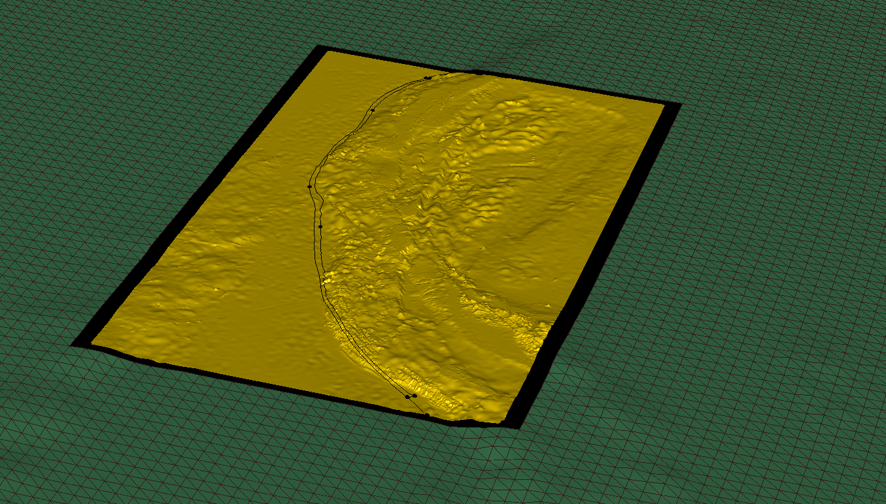
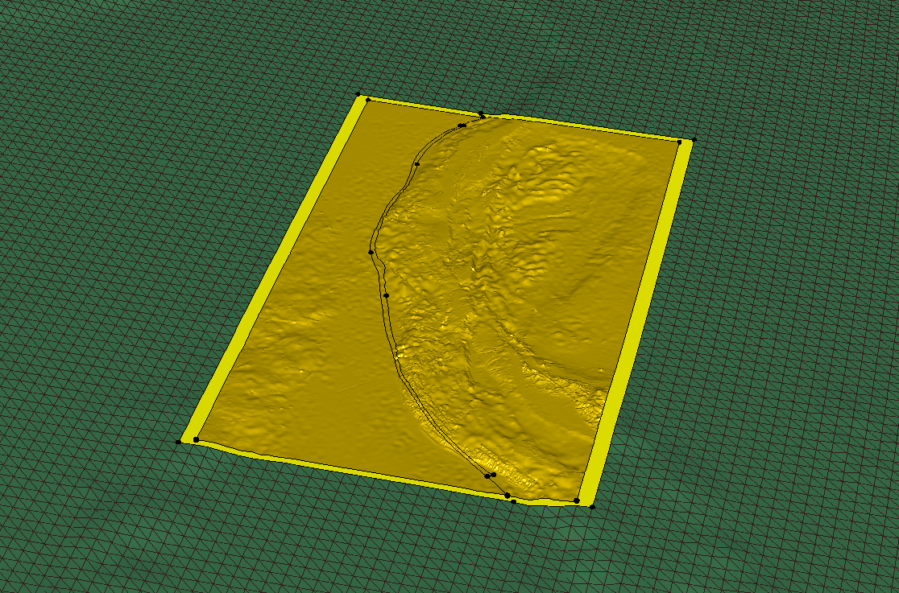
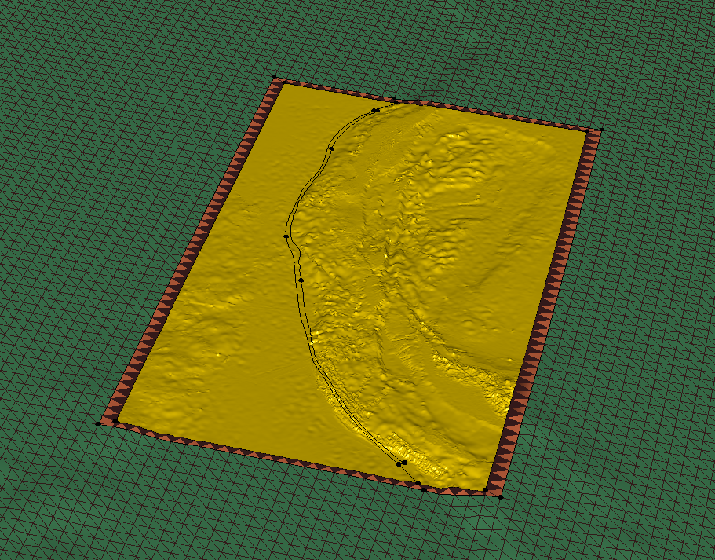

..
  SPDX-FileCopyrightText: 2018-2024 SeisSol Group

  SPDX-License-Identifier: BSD-3-Clause
  SPDX-LicenseComments: Full text under /LICENSE and /LICENSES/

  SPDX-FileContributor: Author lists in /AUTHORS and /CITATION.cff

Adapting the CAD model resolution using Gocad
=============================================

In this example, a finely sampled topography (yellow) has already
undergone several operations in Gocad ( the fault and another structural
interface have been intersected with it). Now we want to extend the
model with a coarsely sampled topography (green surface).

|coarse and fine topography|

The coarse topography has been created using the "hole" and "subsample"
options of the script create_surface_from_structured_grid.py, using the following
command line:

``python3 create_surface_from_structured_grid.py --subsample 8 --objectname topoE --hole 89.5  97.0 1.5 14.5 structuredPointSet.xyz topoExt.ts --proj EPSG:32646``

Now we want to seal the gap between both surfaces. To do that we will
create surfaces "from 2 surface borders". To facilitate the work of
Gocad, we first need to add extra boundary extremities to both surfaces,
at the corners of their borders. We also need to add boundary
extremities to the coarse topography to roughly match the segmentation
of the fine topography border, resulting from the fault intersection.
This is done by:

Right-clicking on the surface >Tools > Border Extremity >Add.

|adding border Extremities|

Then, the surface filling the gap between coarse and fine topography can
be created using: Surface > New > From curves > 2 surface Borders > give
a name, a click on each border. Repeat the operation for each section of
the border. Here is the final result.

|gap filled|

Finally, the new surface can possibly be merged into the coarse
topography.

