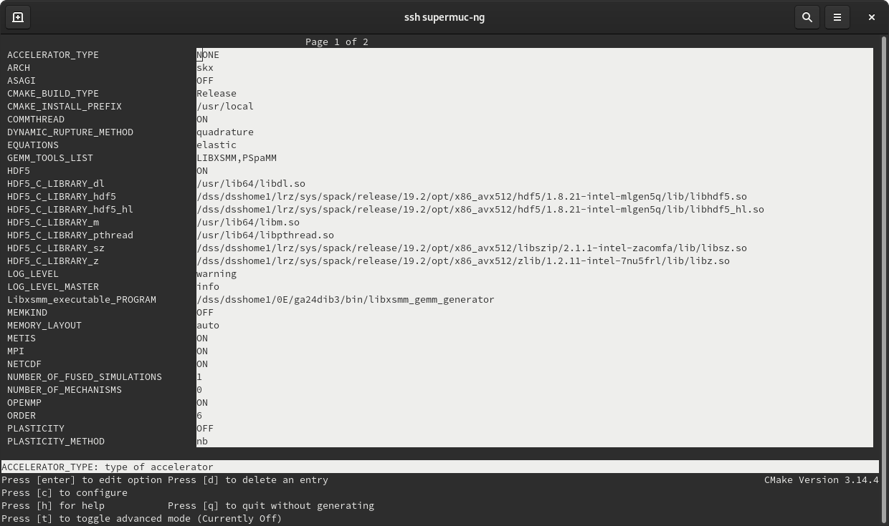

..
  SPDX-FileCopyrightText: 2022-2024 SeisSol Group

  SPDX-License-Identifier: BSD-3-Clause
  SPDX-LicenseComments: Full text under /LICENSE and /LICENSES/

  SPDX-FileContributor: Author lists in /AUTHORS and /CITATION.cff

.. _build_seissol:

Compiling and running SeisSol
-----------------------------

For this page, we will assume that all the environment variables
from the :ref:`previous section <build_env>` to be loaded. That is, you have installed your dependencies to ``$SEISSOL_PREFIX``.

To build SeisSol, fetch the latest version of SeisSol on git by cloning the repository,
including all submodules:

.. code-block:: bash

   git clone --recursive --branch vX.Y.Z --depth 1 https://github.com/SeisSol/SeisSol.git

You may also do a shallow clone by adding ``--depth=1`` which will save a bit of download volume.

To download the full repository, as needed e.g. for development, run

.. code-block:: bash

   git clone --recursive https://github.com/SeisSol/SeisSol.git

Note, however, that the master branch may be unstable.

Building SeisSol
~~~~~~~~~~~~~~~~
Then, given that you have built or installed all required dependencies, you may compile SeisSol for CPUs as follows (or use ``ccmake`` for a GUI):

.. code-block:: bash

   mkdir -p build && cd build
   cmake -DNUMA_AWARE_PINNING=ON -DASAGI=ON -DPRECISION=double -DORDER=4 -DEQUATIONS=elastic ..
   make -j 4

Note that you may need to adjust your host architecture, especially if you are on an ARM-based machine: then you will need to add at least ``-DHOST_ARCH=neon``, or one of the other ARM-compatible architectures.
Sometimes, the ninja build tool can speed up your build process. To use it, add ``-GNinja`` to the cmake command (you might need to delete your cmake folder first to switch from make).

Generally, we recommend using ``PRECISION=single`` for faster simulations. If you experience Inf/NaN errors (cf. also https://github.com/SeisSol/SeisSol/issues/200 ), then setting ``PRECISION=double`` is a good idea.
The ``ORDER`` equals the convergence order which in turn equals degree of the used polynomials plus one.

A full list of build flags can be found :ref:`here <build_parameters>`.

In case of a manual installation of dependencies (and not using the ``setup.sh`` script from the "Installing Dependencies" page), you may have to prepend :code:`CMAKE_PREFIX_PATH` and :code:`PKG_CONFIG_PATH` to the cmake command, e.g. for dependencies installed in :code:`${PREFIX}`:

.. code-block:: bash

   export CMAKE_PREFIX_PATH=$SEISSOL_PREFIX:$CMAKE_PREFIX_PATH
   export PKG_CONFIG_PATH=$SEISSOL_PREFIX/lib/pkgconfig/:$PKG_CONFIG_PATH
   export LIBRARY_PATH=$SEISSOL_PREFIX/lib:$SEISSOL_PREFIX/lib64:$LIBRARY_PATH
   export LD_LIBRARY_PATH=$SEISSOL_PREFIX/lib:$SEISSOL_PREFIX/lib64:$LD_LIBRARY_PATH

It is also important that the executables of the matrix multiplication generators (LIBXSMM, PSpaMM) have to be located in your CMake prefix or your :code:`PATH` variable.

You can also compile just the proxy by ``make SeisSol-proxy`` or only the SeisSol executable with ``make SeisSol-bin``.
Note that currently that compiling the proxy only will still require all necessary dependencies like MPI and Hdf5, even though it does not make use of it.

You can also run ``ccmake ..`` to see all available options and toggle them.

Building for GPUs
~~~~~~~~~~~~~~~~~

When building for GPUs, you will need to install SYCL and gemmforge, chainforge as well.
Also, you will need to supply the device backend and the device architecture.
The backend can be ``cuda``, ``hip``, or one of the SYCL implementations, ``hipsycl`` or ``oneapi``.

Generally, we recommend compiling for simgle precision on GPUs.

To give some examples: for an NVIDIA GH200 Superchip, you would therefore need to set (note that the ``HOST_ARCH`` field here needs to be changed to something ARM-based)

.. code-block:: bash

   mkdir build && cd build
   cmake -DCMAKE_BUILD_TYPE=Release -DHOST_ARCH=sve128 -DPRECISION=single -DORDER=4 -DDEVICE_BACKEND=cuda -DDEVICE_ARCH=sm_90 ..
   make -j 4

For an AMD Instinct MI250X GPU with Zen 3 CPU, you could do

.. code-block:: bash

   mkdir build && cd build
   cmake -DCMAKE_BUILD_TYPE=Release -DHOST_ARCH=milan -DPRECISION=single -DORDER=4 -DDEVICE_BACKEND=hip -DDEVICE_ARCH=gfx90a ..
   make -j 4

On an Intel Data Center Max GPU 1550, you could set

.. code-block:: bash

   mkdir build && cd build
   cmake -DCMAKE_BUILD_TYPE=Release -DHOST_ARCH=skx -DPRECISION=single -DORDER=4 -DDEVICE_BACKEND=oneapi -DSYCL_CC=dpcpp -DDEVICE_ARCH=pvc ..
   make -j 4

Cray compiler environments and GPUs
"""""""""""""""""""""""""""""""""""

When compiling AdaptiveCpp with the Cray Compiler Environment, it may not find some MPI files.
Therefore, you can use the following workaround (given that you know the base compilers, here written as ``COMPILER_C`` and ``COMPILER_CXX``):

.. code-block:: bash

   mkdir -p build && cd build
   CC=$COMPILER_C CXX=$COMPILER_CXX CFLAGS=$(cc --cray-print-opts=all) CXXFLAGS=$(CC --cray-print-opts=all) cmake $!
   make -j 4

Why different builds?
~~~~~~~~~~~~~~~~~~~~~

Currently, SeisSol builds have the following constraints: they are restricted to one PDE, one precision and one polynomial degree usage for discretization

* a single equation system (isotropic elastic, anisotropic elastic, viscoelastic, poroelastic)
* a single polynomial discretization degree (2 to 8)
* a precision (float or double)
* a target architecture

Subsequently, it can be useful to re-build SeisSol multiple times with different configurations.
Each of these SeisSol builds has a different executable name, and they can be installed side-by-side.

Finding out your target architecture
~~~~~~~~~~~~~~~~~~~~~~~~~~~~~~~~~~~~

For SeisSol to work optimally, you will need to find out your CPU and GPU architecture
you want to run on. That is, if you have a cluster, you will usually find the specifications
within the documentation of it. A list of the supported architectures can be found on :ref:`the build parameters page <build_parameters>`.

Generally speaking, if you encounter ``SIGILL`` errors, change your ``HOST_ARCH`` to a less demanding one (e.g. ``skx`` to ``hsw``).

A few heuristics may help in the beginning:

* ``hsw`` if you work with your personal computer or laptop. [#]_
* ``skx`` if on an x86_64 cluster, or a high-end workstation which supports AVX-512, or AVX10/512. (e.g.: SuperMUC-NG, or any cluster with Intel CPUs, or AMD CPUs with Zen 4 or newer).
* ``neon`` on an ARM machine, and specify your CPU over the ``-mcpu`` parameter. If your machine supports SVE (such as A64FX or the Nvidia Grace CPU), then you can also use ``sve128``, ``sve256``, or ``sve512``; but you will still need to specify ``-mcpu``.
* ``noarch`` if nothing else works

.. [#] If your computer is very old (i.e. 2013 or earlier), then you may have to check out ``snb``, ``wsm`` or ``noarch`` instead.

It shall be noted that support for the latest Apple Macbooks using Apple M1 or M2 processors is highly experimental and may lead to an unstable build or incorrect results.

For a list of known CPU (and GPU) configurations, see :ref:`here <build_archs>`.

For GPUs, you may determine the local GPU if you have a viable ``llvm``/``clang`` installation available, e.g. by loading a module.
Then you can run the following commands.
If you are on a cluster, make sure to run them on a compute node.
* run ``nvptx-arch`` to determine the architecture version of the Nvidia GPUs
* run ``amdgpu-arch`` to determine the architecture version of the AMD GPUs (including the integrated GPUs of AMD CPUs)

Alternatively, you can also use:
* ``nvidia-smi --query-gpu compute_cap --format=csv`` for Nvidia GPUs. The numbers will be printed in the format "x.y" which corresponds to "sm_xy". E.g., "8.6" will become "sm_86".
* ``clinfo -l`` for AMD GPUs or Intel GPUs.
* ``rocminfo | grep gfx`` for AMD GPUs.

Minimal builds
~~~~~~~~~~~~~~
For a minimal build (used e.g. to test), you can run:

.. code-block:: bash

   mkdir -p build && cd build
   cmake -DNUMA_AWARE_PINNING=OFF -DASAGI=OFF -DPRECISION=double -DORDER=4 -DEQUATIONS=elastic -DGEMM_TOOLS_LIST=Eigen -DGRAPH_PARTITIONING_LIBS=none ..
   make -j 4

Note that the performance will suffer here with both on single-rank and especially multi-rank setups.

Compile with Score-P
""""""""""""""""""""

The Score-P measurement infrastructure is a highly scalable and easy-to-use tool suite for profiling and event tracing of HPC applications.
To compile with Score-P, use:

.. code-block:: bash

    SCOREP_WRAPPER=off CXX=scorep-mpic++ CC=scorep-mpicc cmake ..
    SCOREP_WRAPPER_INSTRUMENTER_FLAGS="--user --thread=omp --nomemory" make

Running SeisSol
~~~~~~~~~~~~~~~

Once SeisSol has been compiled successfully, enter your build directory and run the SeisSol version of choice.
For instructions on how to run SeisSol on your PC or on your cluster, see :ref:`Running SeisSol <build_run>`.

Further information regarding meshing and parameter files etc. can be
found in the documentation folder. See also :ref:`A first example <a_first_example>`.
