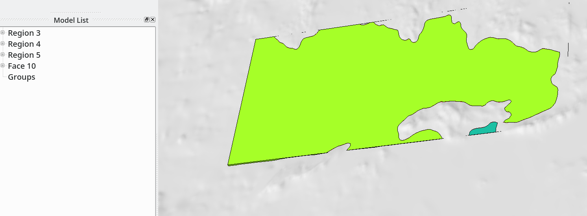

Generating a CAD model for a fully-coupled earthquake-tsunami simulation
==========================================================================

Here we present a workflow for generating a CAD model of the Eastern Aegean Sea, including ocean and topography to be used in fully-coupled earthquake-tsunami simulations of the 2020 Aegean Sea earthquake.
We use scripts from https://github.com/SeisSol/Meshing. To best follow this tutorial, we suggest adding the geometry script folder to the path:

.. code-block:: bash

    export PATH=$PATH:~/SeisSol/Meshing/creating_geometric_models

Please consider running `git pull` in SeisSol/Meshing to pull the latest version of the scripts, if the repository is not newly cloned.
You may also install required python modules with `pip install -r requirements.txt` (or if you use anaconda, `conda install --file requirements.txt`).

Creating topography and boxes
-------------------------------

First, we download topography and bathymetry data from GEBCO
(`http://www.gebco.net/ <http://www.gebco.net/>`__), and we triangulate it into a GoCad ts file.

- Note that we downsample the topography data by a factor 2 for dealing with a reasonable size dataset in this tutorial.
- Note also that we use a custom transverse Mercator roughly centered at the domain center.
- With the option ``--change_zero_elevation 1.0``, we move the nodes with zero elevation to 1.0 m. This avoids having to intersect locally coplanar surfaces.
- With the option ``--smooth 100``, we smooth the topography data which fall in the range :math:`\pm` 100 m. This facilitates the intersection of the sea surface with the topography and allows a smoother coastline (which can else have a saw-tooth shape due to rounded elevation data, stored as integers in Gebco files).

.. code-block:: bash

    myproj='+proj=tmerc +datum=WGS84 +k=0.9996 +lon_0=26.25 +lat_0=37.75'
    topofile='gebco_2021_n39.5_s36.0_w23.5_e29.0.nc'
    create_surface_from_rectilinear_grid.py $topofile topo.ts --proj "$myproj" --sub 2 --smooth 100 --change_zero_elevation 1.0

Next, we generate a mesh of 2 boxes, one for definig the water-layer and the other for defining the domain region.

.. code-block:: bash

    generate_box.py box_water_layer.stl --hdim " -40e3" 93e3 " -10e3" 53.0e3 --zdim " -10e3" 0 --meshSize 600.
    generate_box.py --proj "$myproj" --rangeFromTopo $topofile box_domain.stl --zdim " -200e3" 10e3 --shrink 0.9

Intersecting topography and sea-surface
----------------------------------------

Then we load `box_water_layer.stl` and `topo.ts` into SimModeler (``Import Discrete Data``, select both files (press Shift), and unclick all options except  ``Find edges by face normals``, with ``Normal Angle`` 80, a value high enough to detect the box, but not creating new faces in the topography surface).

We then do ``Unions Parts`` (Tolerance 0.1, smaller than the ``change_zero_elevation`` parameter) with Parts topo and box_water_layer.
This leads to the creation of 3 regions and 1 face.
Region 3 is the solid below the sea-floor, region 4 is the larger ocean region, and region 5 is the small dark green water region.

   Three-regions model obtained after intersecting bathymetry and water-layer box.

The next step is to delete regions 3 and 5 (note that region number may differ). Use ``Discrete->Delete`` add regions 3, and press ``Ok``.
Then Use ``Discrete->Delete`` add regions 5, this time unticking ``Delete Disconnected``.
(If we tick ``Delete Disconnected`` the sea-floor below regions 5 will be removed, leaving a hole in the topography).
Finally, we delete all surfaces except the 2 surfaces defining the topography.

At this point, the model only has 1 region and 2 surfaces (that can be merged with ``Discrete->Combine Faces``).
We can double-check the quality of the intersections with ``Prepare->Remove Small features``.
Here the shortest edge in the model is 139 m, which is large enough.
If this was not the case, small edges can be identified, and the associated node of the not yet intersected topography moved (with ``Discrete->Deform Face``).
Then the full workflow described above needs to be followed again with the updated topography (and hopefully the short edge have been suppressed).

The final step consists of loading `domain_box.stl` and intersecting it with the current model (Actually this intersection currently fails).
We then clean the model of the upper part of domain_box and of the part of the topography outside the domain box.
The model obtained has 2 regions.

   Two-regions model of the Eastern Aegean Sea area, including water layer.

Dealing with union errors
----------------------------

Unfortunately, unions may fail.
At best, a descriptive error is issued by SimModeler, e.g.:
``Error: Code: 604 String: edge 72 has tangent faces at point (61781.436490285792, 3066.1427893521077, -2.2204460492502381e-16)``
In this case, we can overcome the problem by manually moving a node of one of the surfaces intersected close to the location of the error with ``Discrete->Deform Face``.
The error ``Error: Code: 60 String: General error`` may also be raised, for which there is currently no obvious work-around, except trying to changing the mesh size or the dimension of one of the intersected objects.
Hopefully, these error messages will be improved in the future.

Enforcing minimum depth on seafloor surface
-----------------------------------------------

Unfortunately, SimModeler is then not able to mesh the water layer (even with a small mesh size of 100 m, the error ``Cannot resolve intersecting mesh`` is raised), because,
at some locations, the sea floor is very close to the sea surface.
To deal with this problem, we extract the mesh of the sea floor and increase the sea floor depth where it is very close to the sea surface.
This is done with:

- ``Mesh->Miscellaneous->Use Discrete Geometry Mesh`` on the sea-floor and 
- ``Mesh->Element Type->No Mesh->Entity`` on all other surfaces.
- ``Volume Meshing`` should be disabled.
- ``Mesh->Generate Mesh``
- ``Mesh->Export Mesh``: Filename seafloor.inp.

Then we enforce the minimum depth of the seafloor with:

.. code-block:: bash

    convertInp.py seafloor.inp seafloor.stl --enforce_min_depth 25

The next step is to generate an stl file (``other_surfaces.stl``) with all other surfaces from the model using the workflow presented above (with ``--enforce_min_depth`` option but with ``--isolate`` option).

.. code-block:: bash

    convertInp.py other_surfaces.inp other_surfaces.stl --isolate

Both stl files can finally be combined into a stl file using cat:

.. code-block:: bash

    cat seafloor.stl other_surfaces.stl > new_model.stl

Once loaded into SimModeler, 2 regions get detected and the shallow water can be successfully meshed, even with a relatively large mesh size (400 m).
