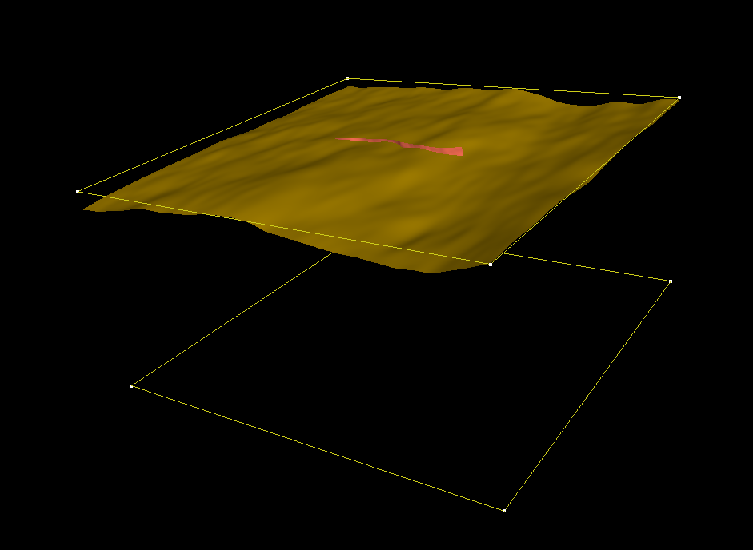
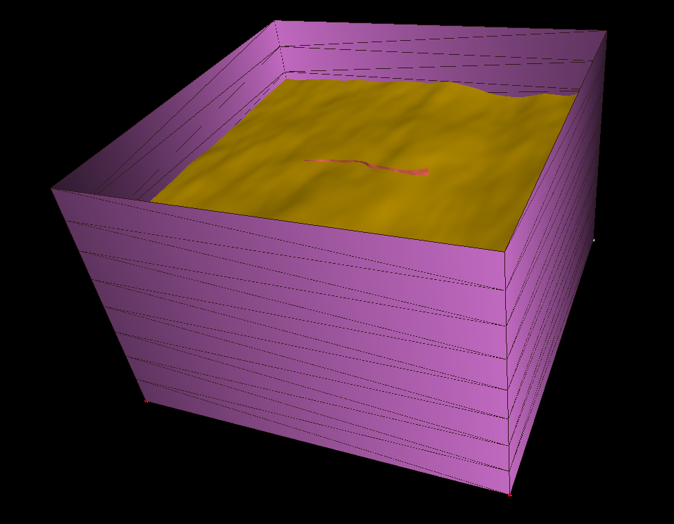
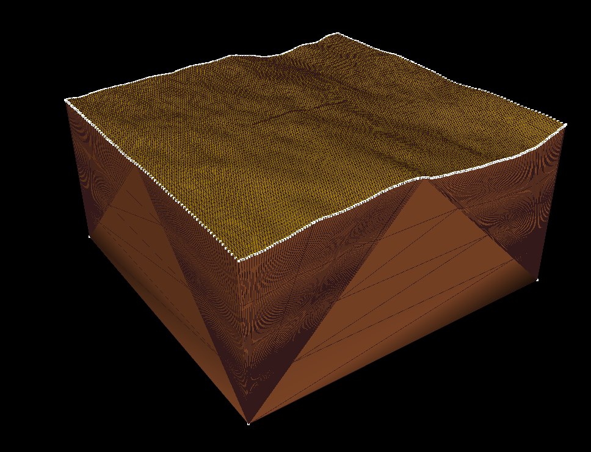
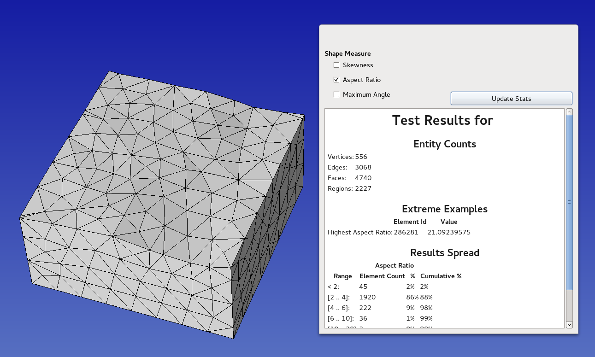

..
  SPDX-FileCopyrightText: 2018-2024 SeisSol Group

  SPDX-License-Identifier: BSD-3-Clause
  SPDX-LicenseComments: Full text under /LICENSE and /LICENSES/

  SPDX-FileContributor: Author lists in /AUTHORS and /CITATION.cff

Generating a CAD model using GOCAD: basic tutorial
==================================================

Input files
-----------

The python scripts used in this tutorial are
`here <https://github.com/SeisSol/Meshing/tree/master/creating_geometric_models>`__
and the input files are
`here <https://github.com/SeisSol/Meshing/tree/master/creating_geometric_models/ExampleFiles>`__.

Two \*.dat files contain the structured point clouds representing the
topographic layer and the fault. The \*.pl file (Gocad ASCII File
format) describes 2 manually set curves used for defining the model
extend.

Triangulating structured point clouds
-------------------------------------

| First, we construct triangulated surfaces from the structured point
  clouds using create_surface_from_structured_grid.py
| ``python3 create_surface_from_structured_grid.py --NX 161 topography.dat topography.ts``
| If the points of the cloud share the same coordinates along a row or a
  column, then the -NX option can be omitted
| ``python3 create_surface_from_structured_grid.py topography.dat topography.ts``

CAD model generation in GOCAD
-----------------------------

| Now let's combine all these data into a CAD model using GOCAD.
| Launch Gocad and create a new project. Use the default modules. Change
  Depth to meters, and Depth axis to Upwards. Don't specify the coordinates system.
  Projecting is done using the python scripts. When creating the surfaces, many scripts have a "--proj" option.
  In addition, the script projTs.py also allows projecting gocad ts files.
  Using projected data in Gocad (as opposed to lat/lon/depth data) seems
  to help the software generating high-quality intersections.

| File > Import > Gocad Objects and select the two surfaces (fault.ts
  and topography.ts) and the \*.pl file.
| |objects in gocad|

Creating the bottom and sides surfaces
~~~~~~~~~~~~~~~~~~~~~~~~~~~~~~~~~~~~~~

| Surface > New > Closed Curved, choose a name, uncheck 'Dissociate
  vertices' in advance (always do that), click on apply and click on the
  curve 'bottom'.
| Surface > New > Builds in Forms/Tube, choose an name, curve 'bottom',
  dir expansion along z 80e3, number of level 8(for example), uncheck
  'Dissociate vertices'.

|objects in gocad 2|

Mutual intersections
~~~~~~~~~~~~~~~~~~~~

Tools > cut > mutual cut among surfaces > select side surface, fault and
topography. Tools > Part > delete selection: click on the portion of
the fault surface higher than the topography. Then on the part of the
side surface higher than the topography.

Alternative way of Creating the side surface
~~~~~~~~~~~~~~~~~~~~~~~~~~~~~~~~~~~~~~~~~~~~

| Sometimes the mutual intersection of Gocad does not work properly (in particular when the intersection curve passes close to triangle edges on both surfaces).
  Then the surfaces to be intersected have to be manually adjusted, for example by switching triangles (Tools >
  Triangle > Switch 2 triangles), to allow the intersection to work properly.
  Alternatively, a different way of generating the surface could be considered.
  For instance, the side surfaces can be generated from the 2 curves bordering the topography and the bottom surface:
| Curve > New > Borders > all, use surface topography to create curve
  ctopo. Surface > New > 2 curves parts > select a name, choose a number
  of level (e.g. 4) and click on both curves.
| Here is the resulting model: |alternative side|

A third option for creating the side surface
~~~~~~~~~~~~~~~~~~~~~~~~~~~~~~~~~~~~~~~~~~~~

| If a projection has been already done on the topography surface, then
  the borders of the surface are probably not any more straights, and the previous method may not be applicable anymore.
  In such a situation, we can still create a tube from the border of the topography, and cut it at the required depth.
  Curve > New > Borders > all, use surface topography to create curve ctopo.
| Surface > New > Builds in Forms/Tube, choose an name, curve 'ctopo',
  dir expansion along z -80e3, number of level 8(for example), uncheck
  'Dissociate vertices'.
| To trim the tube at the requested depth, we export the curve ctopo in
  a pl file (File > Export > Gocad ASCII >ctopo.pl) and we use the
  script change_depth_pl_curve.py:
| ``python3 change_depth_pl_curve.py ctopo.pl ctopo_new.pl --depth 60e3``
| Then we import ctopo_new.pl into the project, create the bottom
  surface of the box from it (using Surface > New > Closed Curved). We
  can then intersected this new surface with the tube, and remove the
  part of the tube below the bottom box surface.

Exporting and converting to stl
-------------------------------

Now the triangulation of all surfaces of the CAD model is conforming,
and we can export the CAD surface in a ts format.

| File > Export > Gocad ASCII > choose a filename (example test.ts).
| Now let's convert the ts file to stl using convertTs.py:
| ``python3 convertTs.py test.ts``
| The --merged option merges all surfaces in a single stl 'solid'. If
  not set, each Gocad surface will be isolated into a different stl
  'solid'. Each surface will then be viewed as a different entity by
  SimModeler.
| The option --proj allows projecting into a new coordinate system (e.g.
  --proj EPSG:32646).

Sanity check
------------

| We can now quickly check that the CAD model is correct, by loading it
  into SimModeler.
| File > Import Discrete Data > select file and click on OK.
| In Model list, we have a single region and no singled-out surfaces.
| Model Tab > Remove Small Features: Shortest edge in the model should be
  big in comparison to your smallest mesh size.
  If not, you can specify a tolerance and have a look at the location of the small features.
  If they are located in the vicinity of some surface mutual intersection made with Gocad, this stage failed and you have to go back working on your CAD model, for example following this guide: [[Manually fixing an intersection in Gocad]].
| If everything was fine in the previous checks proposed, we can make a
  last verification by meshing coarsely the model using
| Meshing > Generate mesh. We can finally inspect the mesh:
| Display tab > check Mesh Stats > then check Aspect Ratio, and see if
  the maximum aspect ratio has a reasonable value (~20). |final mesh|

