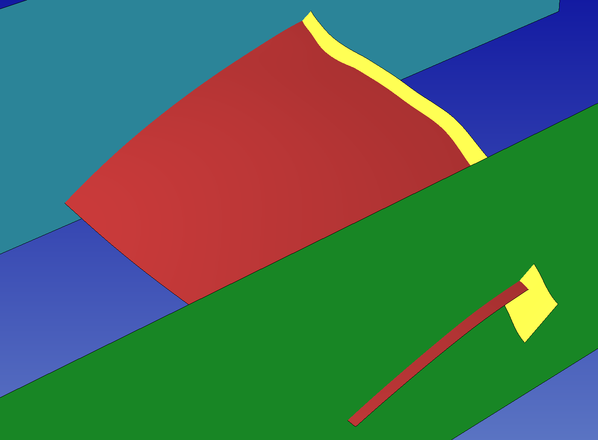
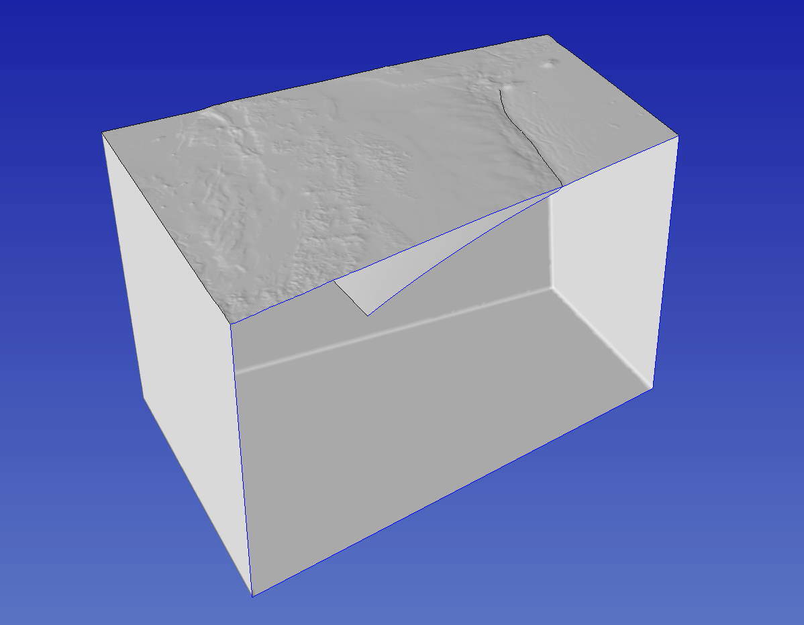

..
  SPDX-FileCopyrightText: 2022-2024 SeisSol Group

  SPDX-License-Identifier: BSD-3-Clause
  SPDX-LicenseComments: Full text under /LICENSE and /LICENSES/

  SPDX-FileContributor: Author lists in /AUTHORS and /CITATION.cff

Proposed workflow for generating a CAD model of a megathrust earthquake
========================================================================

Here is present a workflow for generating a CAD model of the Japan subduction, including subduction interface, to be used in dynamic rupture models or for imposing a kinematic model on the subduction interface.
We use scripts from https://github.com/SeisSol/Meshing. To best follow this tutorial, we suggest adding the geometry script folder to the path:

.. code-block:: bash

    export PATH=$PATH:~/SeisSol/Meshing/creating_geometric_models

topography and slab interface
-----------------------------

First, we download topography and bathymetry data from GEBCO
(`http://www.gebco.net/ <http://www.gebco.net/>`__), and we triangulate it into a GoCad ts file.
Note that we downsample the topography data by a factor 5 for dealing with a reasonable size dataset in this tutorial.
Note also that we use a custom transverse Mercator roughly centered at the domain center.

.. code-block:: bash

    #!/bin/sh
    myproj='+proj=tmerc +datum=WGS84 +k=0.9996 +lon_0=143 +lat_0=39'
    topofile='data/gebco_2021_n42.61596679687501_s34.16381791234017_w137.10571333765984_e146.759033203125.nc'
    create_surface_from_rectilinear_grid.py $topofile tmp/topo.ts --proj "$myproj" --sub 5

Next, we generate a mesh of the subduction interface.
We use the Kamchatka-Kuril Islands-Japan Region model of Slab2.0 available here `<https://www.sciencebase.gov/catalog/item/5aa4060de4b0b1c392eaaee2>`__.
We download kur_slab2_dep_02.24.18.grd and rename it as kur_slab2_dep_02.24.18.nc.
Finally, we crop and triangulate it using the following command:

.. code-block:: bash

    create_surface_from_rectilinear_grid.py data/kur_slab2_dep_02.24.18.nc tmp/ur_slab2_dep_02.24.18.ts --crop 140 145 35.5 41 --proj "$myproj"

The Slab2.0 data are sampled every 5 km, but a dynamic rupture simulation may require one order of magnitude smaller resolution, or even more.
If we mesh at 500m a geometry sampled at 5 km, the obtained mesh won't be smooth but will have edges every 5 km.
Therefore, we smooth and refine the mesh with:

.. code-block:: bash

    refine_and_smooth_mesh.py --N 0 --P 1 tmp/ur_slab2_dep_02.24.18.ts

The help (-h option) offers further details about the script options.
Here we use P=1 to avoid dealing with a too large dataset in the tutorial.

Terminal splay
--------------

The shallowest part of the subduction interface is 5-10km below the sea surface. We might want to acknowledge the possibility of surface rupture by extendiing the interface to the surface at steeper angle.
We therefore build a terminal splay extending from the trace of the know trench location.
For that, we first preprocess a USGS trench data file into a fault trace. Then we extend the trace along a constant dip angle.

.. code-block:: bash

    generate_trace_terminal_splay.py --shift -0.05 0 --filter_trench 137.2 146.7 35.2 41.2 jap --usgs_trench_file data/trenches_usgs_2017_depths.csv --bathymetry $topofile --plot tmp/extractedtrenchTohoku.dat
    create_fault_from_trace.py tmp/extractedtrenchTohoku.dat 0 30 --proj "$myproj" --maxdepth  20e3 --extend 8000 --extrudeDir data/strike90.dat --dd 5000 --smoothingParameter 1e7
    refine_and_smooth_mesh.py --N 0 --P 1 extractedtrenchTohoku0.ts

data/strike90.dat contains 2 lines, indicating that the extrude direction is towards West.

.. code-block::

    0 -90
    1 -90

Merging terminal splay and subduction interface
-----------------------------------------------

First, we generate 2 planes that we will use to trim slab interface and extension to the same dimension.

.. code-block:: bash

    python generate_cutting_plane.py  --center -65000 -367000 -11000  --normal 0. 1. 0.  --dims 1000e3 300e3 --mesh 10e3 tmp/cut1.stl
    python generate_cutting_plane.py  --center 125000 210000 -11000  --normal 0. 1. 0.  --dims 1000e3 300e3 --mesh 10e3 tmp/cut2.stl

Then we load both processed subduction interface and terminal splay into SimModeler.
We intersect them, and trim what can be trimmed.
Then we import the cutting plane, and intersect all parts.
We finally remove all parts that are not faults.
At this point we have 2 connected surfaces, subduction interface and terminal splay, and a sharp angle between them.
This sharp angle can be smoothed by extracting the discrete mesh as inp file (see :ref:`Remeshing the topography`), converting to ts and applying the refine_and_smooth_mesh.py script.

   Discrete geometry model of the slab interface (red), a potential terminal splay fault (yellow), and the cutting planes (blue and green) used to trim laterally these surfaces, before interesection.

Final steps
-----------

Finally, we create a box mesh box domain with pygmsh as follow:

.. code-block::

    generate_box.py --proj "$myproj" --rangeFromTopo $topofile tmp/box.stl --zdim " -500e3" 5e3 --shrink 0.9

The final step consists in intersecting all objects (topography, faults and domain box) in the GUI of SimModeler, as presented in :doc:`simmodelerCAD-workflow`.

   Cut view of the final Tohoku's model

