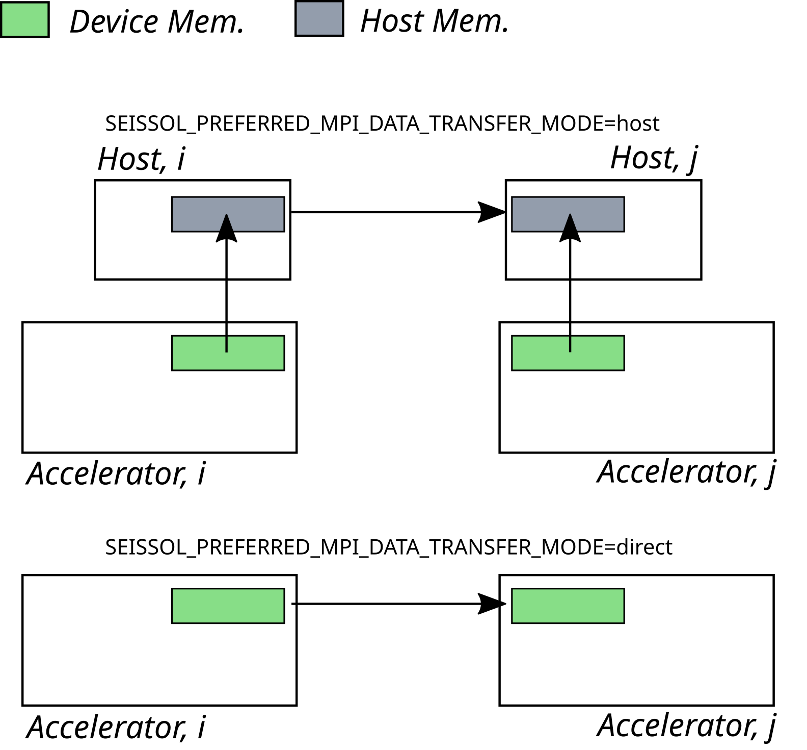

..
  SPDX-FileCopyrightText: 2021-2024 SeisSol Group

  SPDX-License-Identifier: BSD-3-Clause
  SPDX-LicenseComments: Full text under /LICENSE and /LICENSES/

  SPDX-FileContributor: Author lists in /AUTHORS and /CITATION.cff

SeisSol with GPUs
=======================================

General
~~~~~~~

.. _gpu_process_pinning:

The current GPU version of SeisSol targets the latest NVIDIA and AMD graphics cards. Therefore, you
need to have at least CUDA 11.8 or ROCm 6.0 installed in your environment. Moreover, make sure
that your installed MPI implementation is GPU-aware. If you are unsure, consult the documentation of the cluster you are using.

You can also utilize `UCX communication layer
<https://github.com/openucx/ucx>`_ if you need to manually configure CUDA-Aware MPI for a cluster or your local server
with an open-source MPI implementation e.g., OpenMPI.

GPU version of SeisSol follows *single rank/single GPU* strategy. Therefore,
if you want to run SeisSol on **M** nodes where each node is equipped with **N** GPUs then
make sure that you launch SeisSol with **M x N** MPI processes.

To achieve the most efficient CPU-to-GPU communication and vice versa you have
to pin your MPI processes to CPU cores which are the closest to the target
GPUs. This problem is also known as GPU affinity. Latest versions of workload
managers (e.g. SLURM) are aware of this problem and try to provide an
automatic, GPU-aware process pinning. Consider the following SLURM options:

- ``--ntasks-per-gpu``
- ``--gpu-bind``

You can also enforce good GPU affinity with rankfiles if your GPU cluster or local server
does not use a workload manager but is equipped with multiple GPUs per node.

   Correct process pinning of 4 MPI processes where each process
   controls 3 OpenMP threads and one communication thread.

Some systems have complex numbering of processing units and/or NUMA domains.
Sometime it is very difficult to achieve desirable pinning of the communication and/or
output-writing threads with HPC resource managers like SLURM. Therefore, SeisSol provides
``SEISSOL_FREE_CPUS_MASK`` environment variable which helps to describe locations
of the auxiliary threads per local MPI process. The variable accepts a comma separated
list of elements where an element can be either 1) an integer, or 2) a range of
integers defined as *[start, end]* or 3) a comma separated list of integers
surrounded by the curly brackets. The *i*-th list element describes the free cpus
locations for the *i*-th local MPI process.

.. code-block:: bash

  # SEISSOL_FREE_CPUS_MASK="(int | range: <int-int> | list: {int,+})+"
  # Examples,
  export SEISSOL_FREE_CPUS_MASK="24,28,32,36"
  export SEISSOL_FREE_CPUS_MASK="24-27,28-31,32-35,36-39"
  export SEISSOL_FREE_CPUS_MASK="{24,25},{28,29},{32,33},{36,37}"

  # Note, it is allowed to mix the formats of list elements. For example,
  export SEISSOL_FREE_CPUS_MASK="24,28-31,{28,29},36"

Supported SeisSol features
~~~~~~~~~~~~~~~~~~~~~~~~~~

- acoustic and elastic (isotropic, anisotropic) wave propagation models
- kinematic point sources
- dynamic rupture (all friction laws)
- off-fault plasticity model

Experimental branches include support for visco-elastic wave propagation as well.

Compilation
~~~~~~~~~~~

To start off, make sure that you already have **GemmForge** installed on your system.
If you don't have then follow this :ref:`link <gemmforge_installation>`.

After that, get the latest version of SeisSol

.. code-block:: bash

   git clone --recurse-submodules https://github.com/SeisSol/SeisSol.git seissol-gpu

Compile SeisSol with (e.g.)

.. code-block:: bash

    mkdir -p seissol-gpu/build && cd seissol-gpu/build
    cmake -DDEVICE_BACKEND=cuda -DDEVICE_ARCH=sm_70 -DHOST_ARCH=skx \
    -DCMAKE_BUILD_TYPE=Release -DPRECISION=double ..
    make -j

The following two CMake options can be useful to improve performance:

* ``USE_GRAPH_CAPTURING``: enables CUDA/HIP graphs. These are used to speed up the kernel execution for wave propagation equations.
* ``PREMULTIPLY_FLUX``: enables the pre-multiplying of flux matrices (it was disabled for CPUs to free up cache space). This usually results in a speedup for AMD and Nvidia GPUs. By default, it is switched on when compiling for an AMD or Nvidia GPU and switched off in all other cases.
* ``DEVICE_EXPERIMENTAL_EXPLICIT_KERNELS``: enables a hand-written kernel to speed up some internal, heavily memory-bound computations. Enabled for AMD and NVIDIA GPUs by default; but it works on all others as well.

Execution
~~~~~~~~~

The launching process of the GPU version of SeisSol is similar as the one of the CPU version.

.. code-block:: bash

    mpirun -n <M x N> ./SeisSol_dsm70_cuda_* ./parameters.par

It is important to know that the GPU version of SeisSol by default allocates 1GB of
GPU memory at the beginning of SeisSol execution. It is necessary for fast allocation/deallocation
of GPU memory needed for holding temporary data. The default value can be changed by setting
a necessary one to **DEVICE_STACK_MEM_SIZE** environment variable. For example,
the following will force SeisSol to allocate 1.5GB of stack GPU memory for temporary data:

.. code-block:: bash

    export DEVICE_STACK_MEM_SIZE=1.5
    mpirun -n <M x N> ./SeisSol_dsm70_cuda_* ./parameters.par

The following device-specific environment variable is supported right now:

* ``SEISSOL_PREFERRED_MPI_DATA_TRANSFER_MODE``

Currently, SeisSol allocates MPI buffers using the global memory type.
Some MPI implementations are not GPU-aware and do not support direct point-to-point
communication on device buffers. SeisSol provides the ``SEISSOL_PREFERRED_MPI_DATA_TRANSFER_MODE``
environment variable that can be used to select the memory type for the buffers.
The ``host`` value means that the data will be copied to/from the host memory
before/after each ``MPI_Isend`` / ``MPI_Irecv``.
The default value is ``direct`` which copies the data out of the GPU buffers directly.

