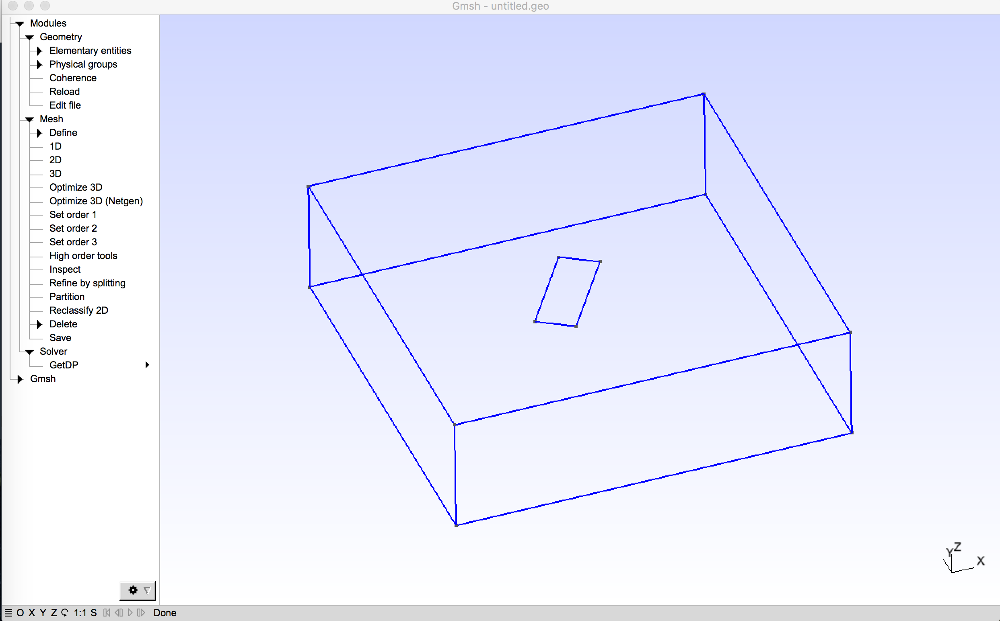
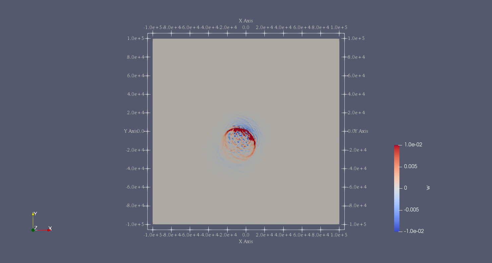

..
  SPDX-FileCopyrightText: 2019-2024 SeisSol Group

  SPDX-License-Identifier: BSD-3-Clause
  SPDX-LicenseComments: Full text under /LICENSE and /LICENSES/

  SPDX-FileContributor: Author lists in /AUTHORS and /CITATION.cff

.. _northridge:

Kinematic source example - 1994 Northridge earthquake
=====================================================

We use a model of the 1994 Northridge earthquake to illustrate
how to set up kinematic models in SeisSol.

This Mw6.7 earthquake occurred in the San Fernando Valley region of Los Angeles, California, USA on January 17.
The estimated duration of this typical reverse-slip earthquake ranges between 10 and 20s.
The ruptured fault strikes N122\ :math:`^\circ`\ E and dips at 40\ :math:`^\circ`.

Geometry
~~~~~~~~

The structural model is built with Gmsh.
It features a planar fault of 20 km :math:`\times` 25 km dipping 40 :math:`^\circ`,
within a half-space region of 100 km :math:`\times` 100 km :math:`\times` 60 km

   Geometry assumed for the 1994 Northridge earthquake scenario.

Kinematic rupture Source
~~~~~~~~~~~~~~~~~~~~~~~~

Kinematic models in the *standard rupture format* can be used directly in SeisSol,
after converting them to nrf with the rconv tool (see next and :doc:`standard-rupture-format` for more details), with the following
lines in the parameter.par file:

::

  &SourceType
  Type = 42
  FileName=’northridge.nrf’
  /

A description of the standard rupture format can be found at https://strike.scec.org/scecpedia/Standard_Rupture_Format.
Please note that some variables describing the kinematic model are given in non SI units.

The fault of the Northridge model is divided into 20 point-sources along strike times 25 point-sources
along dip. This can be seen in the SRF file header, whose format is the following:

::

  version (1.0)
  PLANE 1
  ELON ELAT NSTK NDIP LEN WID STK DIP DTOP SHYP DHYP
  POINTS NP

With:

ELON top center longitude
ELAT top center latitude
NSTK number of point sources (subfaults) along strike
NDIP number of point sources (subfaults) down-dip
LEN segment length (km)
WID segment width (km)
STK segment strike
DIP segment dip
DTOP depth to top of fault segment (km)
SHYP along strike location (from top center) of hypocenter for this segment (km)
DHYP down-dip location (from top edge) of hypocenter for this segment (km)
NP Number of points in fault plane

Each point source (subfault) is described in the file in a data block, with the following format:

::

  LON LAT DEP STK DIP AREA TINIT DT
  RAKE SLIP1 NT1 SLIP2 NT2 SLIP3 NT3
  SR1[1] SR1[2] SR1[3] . . . SR1[NT1]
  SR2[1] SR2[2] SR2[3] . . . SR2[NT3]
  SR3[1] SR3[2] SR3[3] . . . SR3[NT3]
  ...

With:

LON: longitude of subfault center
LAT: latitude of subfault center
DEP: depth of subfault center (km)
STK: strike
DIP: dip
AREA: area of subfault (cm^2)
TINIT: initiation time when rupture reaches subfault center (sec)
DT: time step in slip velocity function (sec)
RAKE: direction of u1 axis (rake direction)
SLIP1: total slip in u1 direction (cm)
NT1: number of time points in slip rate function for u1 direction
SLIP2: total slip in u2 direction (cm)
NT2: number of time points in slip rate function for u2 direction
SLIP3: total slip in u3 (surface normal) direction (cm)
NT3: number of time points in slip rate function for u3 direction
SR1[1],…,SR1[NT1] slip rate at each time step for u1 direction (cm/sec)
SR2[1],…,SR2[NT2] slip rate at each time step for u2 direction (cm/sec)
SR3[1],…,SR3[NT3] slip rate at each time step for u3 direction (cm/sec)

Project geographic coordinates
^^^^^^^^^^^^^^^^^^^^^^^^^^^^^^

The geographic coordinates of the source model are projected to Cartesian
coordinates with the pre-processing tool `rconv
<https://github.com/SeisSol/SeisSol/tree/master/preprocessing/science/rconv>`_.

::

  rconv -i northridge.srf -o northridge.nrf -m "+proj=tmerc +datum=WGS84 +k=0.9996 +lon_0=-118.5150 +lat_0=34.3440" -x visualization.xdmf

Results
~~~~~~~

The fault is ruptured over 7s, leading to a MW6.7 earthquake.
A snapshot of the vertical ground-surface velocity at 7s after rupture onset in shown below.

   vertical ground-surface velocity at 7 s after rupture onset. Note the unsmooth velocity field due to the coarse resolution of the kinematic model used.

