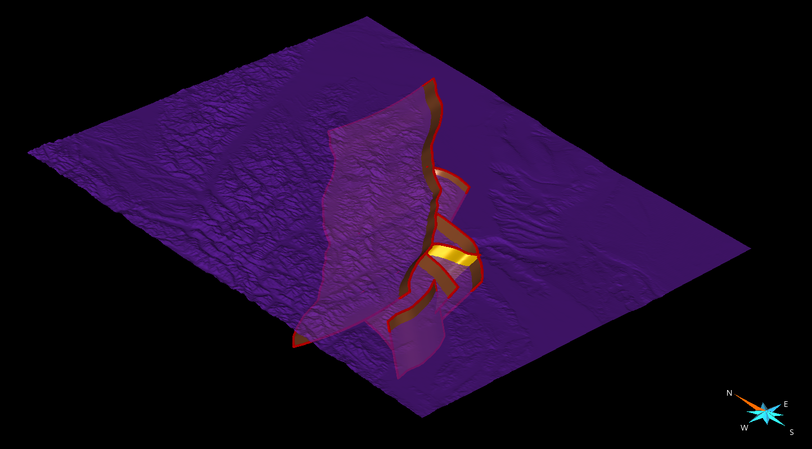
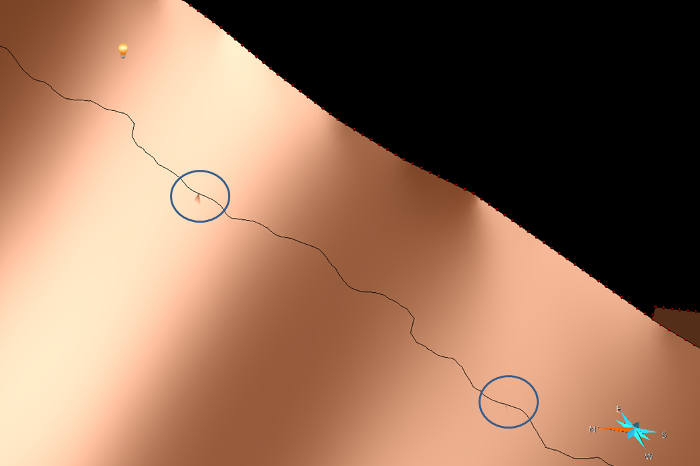
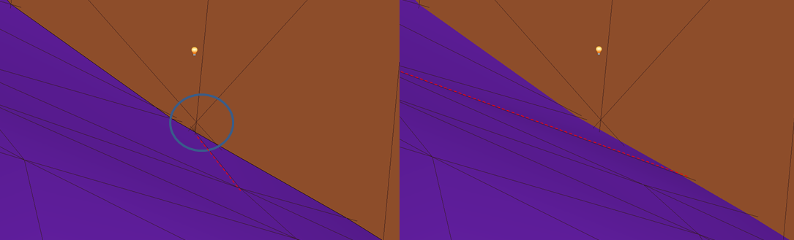

..
  SPDX-FileCopyrightText: 2018-2024 SeisSol Group

  SPDX-License-Identifier: BSD-3-Clause
  SPDX-LicenseComments: Full text under /LICENSE and /LICENSES/

  SPDX-FileContributor: Author lists in /AUTHORS and /CITATION.cff

Manually fixing an intersection in Gocad
========================================

| The mutual intersection in Gocad is the keystone of our geometry
  building framework, but is also the bottleneck. In fact, it is a black
  box, which fails in given geometric configurations: Sometimes it
  generates tiny holes preventing building a volume out of the surfaces,
  or it creates tiny misoriented faces, that cannot be attached to an
  existing surface, and then lead to very small time steps, so small
  that they impact the simulation time even with local time stepping
  enabled. So far, we did not find any better solution than fixing
  manually the geometry.
| Here we detail a systematic way of fixing the intersection, using a
  realistic example. We then try to intersect a complex fault system
  (yellow and orange surfaces, about 250k triangles) with a finely
  meshed topographic surface (blue surface, about 1M triangles).

|overall view|

| The first step of the workflow is to carry out the intersection, to
  visualize the problematic area of the mesh to be fixed.
| Surface>Tools>Cut>Mutual cut among surfaces>select the surface and
  Apply
| The next step is to import the intersected surfaces in SimModeler.
  Then we use the standard procedure:
| File > Export > Gocad ASCII > choose a filename (example test.ts).
| We then convert the ts file to stl using convertTs.py:
| ``python convertTs.py test.ts``
| Finally we import the stl file in SimModeler using:
| File > Import Discrete Data > unclick all option, select file and
  click on OK.
| Now let's check for small features in the geometry:
| Model Tab > Remove Small Features > Find (note that we do now remove
  the small features here, but we only localize them).
| SimModeler will list faces and edges. Nevertheless, we only focus on
  the faces, the edges being usually the edges of the faces listed.

Graphic search for the small features
-------------------------------------

At this point, one possible option is to select one of the small feature,
click on focus on selected, and then try to zoom out to see where the
face is located. In practice, it might not be so easy. Once you have
localized the face in SimModeler, you can try to find it in gocad by
playing with the light. In fact, the small features have usually a
different normal orientation that the surrounding faces, and their edges
may be visible under certain light incidences. Here is an example of 2
features poping out:

|localizing small features|

meshing the small features to get their coordinates
---------------------------------------------------

| A preferable option, because more systematic, for localizing the small
  features is to mesh them in SimModeler, export the mesh in an ascii file, and read the node's coordinates.
  Then mouse over the intersected surface, along the intersection line up to each of the coordinates.
  To mesh them, click on each small features faces, and choose 'Use
  discrete Geometry mesh'. Then click on all other faces, and choose 'No
  mesh/Entity'. Finally, remove the 'Volume meshing' attribute, and click on 'Generate Mesh'. The surface mesh can then be exported:
| File>Export Mesh> Format ABAQUS 2D (for instance), enter a filename
  and save.
| The ascii mesh look like that:

   | \*Heading
   | \*Node
   | 1, 6186870.5469, -3926750.75, 134.60108948
   | 2, 6190219.5312, -3912085.8125, 950.25006104
   | 3, 6127079.0312, -3952731.3125, 411.05957031
   | (...)
   | 236, 6101705.5938, -3992835.8125, 297.36010742
   | 237, 6099955.5938, -3962585.8125, 595.60552979
   | \*Element, Type=S3R, Elset=gface2
   | 34279, 42, 59, 4
   | 329262, 2, 59, 42
   | \*Element, Type=S3R, Elset=gface3
   | 550757, 1, 30, 31
   | 1011559, 31, 30, 8
   | \*Element, Type=S3R, Elset=gface4
   | 909933, 5, 86, 6

It features 237 nodes, but actually only 5 faces. We then look for the
coordinates of each face's node, here, for instance, the coordinates of
nodes 42,59,4,2,42,etc.

Fixing the intersection
-----------------------

Now that the small features have been localized, we will try to fix
them. To do that we first load the gocad model prior to the
intersection, and we also load the intersected surfaces (previously save
in a ts file), to keep track of the localization of the small features.
Then for each small features, we identify why the intersection failure,
and we amend the triangulation, to remove the cause of the failure.
Usually, the failure is due to intersecting or almost intersecting
edges. For instance here:

|fixing intersection|

| We see that the small feature seems related to the edge intersection
  circled. We then switch 2 triangles of the blue surface sharing the incriminated edge, which has the virtue of moving the edge.
  For that we use (for instance):
| Right-click on the surface>Tools>Triangles>Switch Triangles> click on
  both triangles.
| When then apply this manual procedure on all detected small features,
  and we finally make the mutual intersection. Hopefully, the model once loaded in SimModeler is then free of small features!

