Dynamic rupture model - 2018 Palu earthquake
============================================

A magnitude 7.5 earthquake struck north of Palu, Indonesia on 
September 28, 2018 at 6:03 pm local time (10:03 am UTC). This earthquake 
occurred as a result of Palu-Koro strike-slip fault system at shallow 
depths followed by an unexpected localized tsunami within Palu Bay.

Geometry
~~~~~~~~
**Building a 3D model with complicated geometries using Simmodeler**

1. Creating a high resolution topography and bathymetry free surface 
and merge it with a simple box model

-  Creating the topographic layer

We create the topography from a NetCDF file downloaded from https://www.gebco.net/.

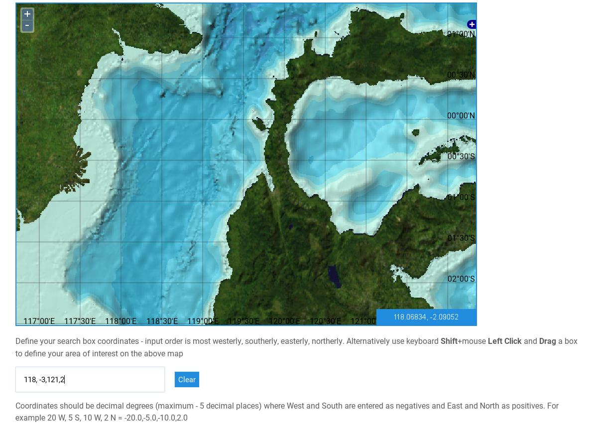

   Screenshot from GEBCO. GEBCO’s gridded bathymetric data sets are global 
   terrain models for ocean and land. 

We then project the data, triangulate it and  export it as stl (list of triangles):
::
  
  python createGOCADTSurfNXNY_netcdf.py --proj +init=EPSG:23839 data/GEBCO_2014_2D_118.1904_-2.4353_121.6855_1.0113.nc bathy.stl
  
We then load the stl file into SimModeler: File > import discrete data.. > bathy.stl

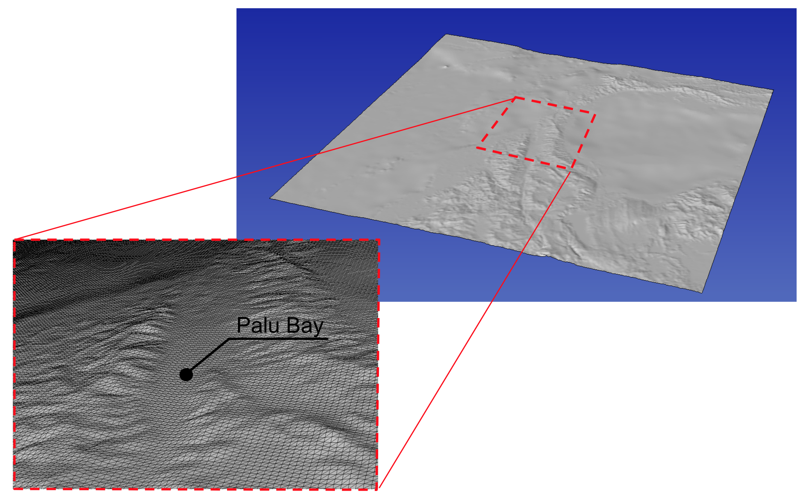

   Screenshot of triangulated topography data in SimModeler. 

Note that in SimModeler import options, importing with a small angle isolate tiny faces from the main surface, 
that then needs to be accounted for by the mesh.

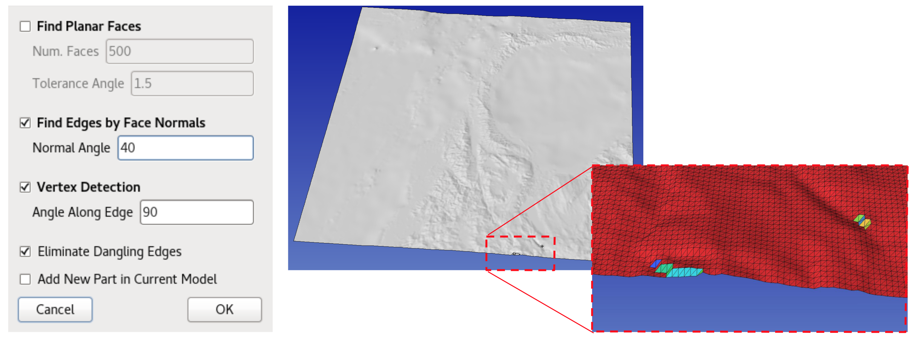

   Screenshot of import options in SimModeler. 

-  Creating the domain box

We generate a simple box with `Gmsh <https://gmsh.info/>`_:
::
  
  gmsh -2 create_box.geo -format stl

The box dimensions are such as the topography is slightly wider than the box. 
The mesh size is chosen small enough to facilitate intersection with topography 
and large enough to limit the number of elements.
::
  
  mesh_size = 10e3;
  Xmax = -160e3;
  Xmin = 215e3;
  Ymin = 1235e3;
  Ymax = 1605e3;
  Zmin=-200e3;
  Zmax=5e3;

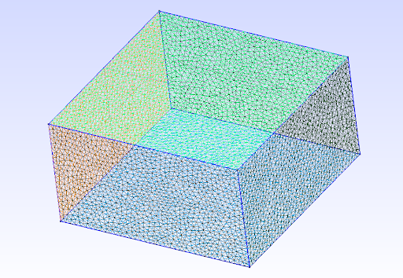

   Screenshot of domain box in Gmsh. 

-  Merging topographic layer with a simple box model

We first import create_box.stl with import options: activating 'Edges by Face Normals' with 
normal angle 60\ :math:`^\circ`, activating 'Vertex Detection' with angle along edge 90\ :math:`^\circ`, 
and eliminating 'Dangling Edges'. Then we import the topographic layer bathy.stl with increasing 
'Edges by Face Normals' normal angle to 80\ :math:`^\circ` and activating 'Add New Part in Current Model'.

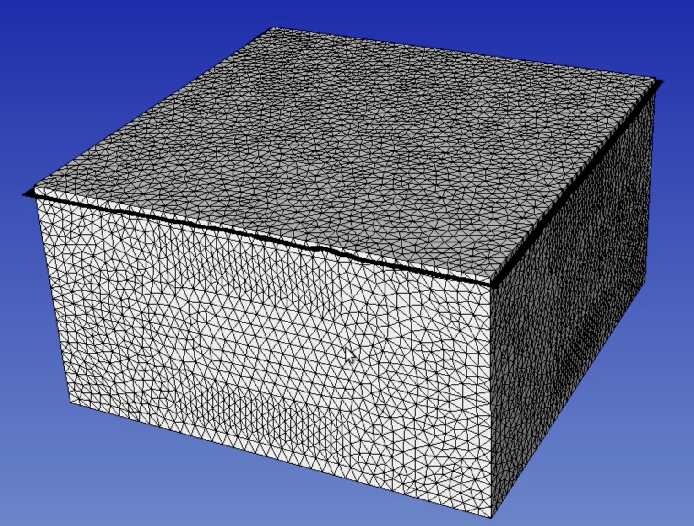

   Screenshot of imported topographic layer and the simple box model in SimModeler. 

We then merge both models by using 'Union Parts' in the 'Discrete' tab and 
apply with tolerance 0.1.

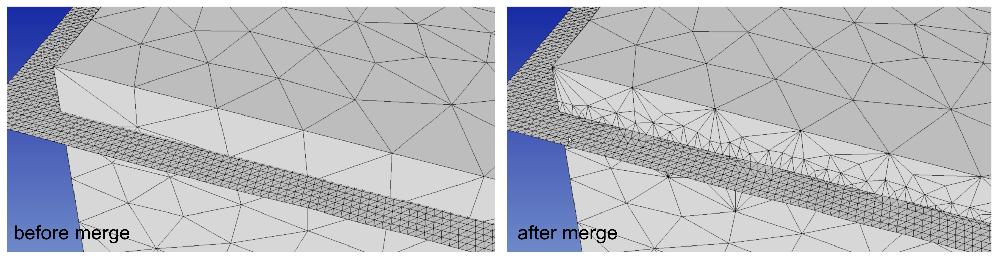

   Screenshot of before and after merging topographic layer with the simple 
   box model in SimModeler. 

We then remove excess from both models using 'Delete' in the 'Discrete' tab. 

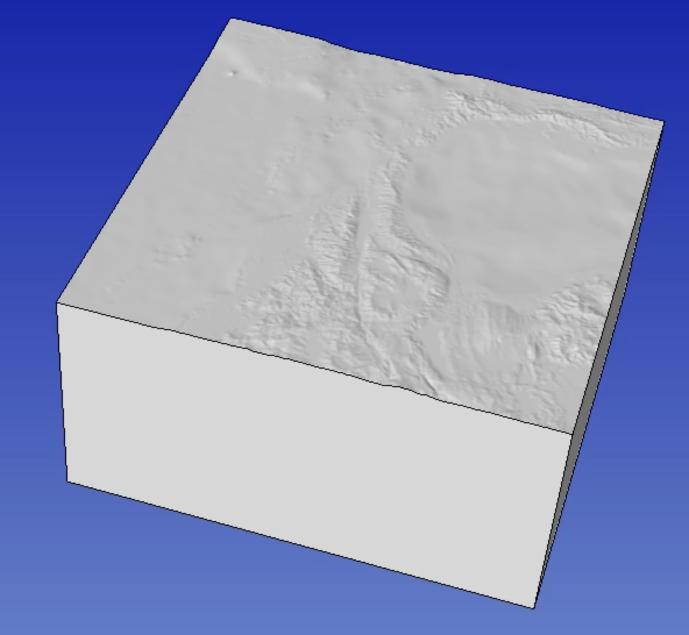

   Screenshot of merged domain in SimModeler. 

2. Creating complex fault networks constrained by fault traces and dip 

-  Building faults from trace and dip 

We generate the fault plane using 'createFaultFromCurve.py'. Note that during 
building a fault model we need: smooth and resample fault trace, sweep trace 
towards z positive (because the topography can have positive z) and negative z, 
and constant or varying dip selection.

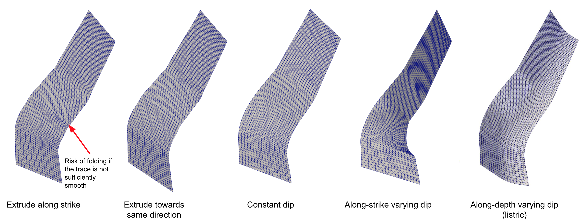

   Screenshot of building fault model from trace and dip.

-  Application to Palu

The faults then are straightforwardly created using:

::
  
  dx=0.5e3
  python ~/SeisSol/Meshing/GocadRelatedScripts/createFaultFromCurve.py data/segmentSouth_d90_long.dat 0 90 --dd $dx --maxdepth 16e3 --extend 4e3
  python ~/SeisSol/Meshing/GocadRelatedScripts/createFaultFromCurve.py data/smootherNorthBend.dat 0 65 --dd $dx --maxdepth 16e3 --extend 4e3
  python ~/SeisSol/Meshing/GocadRelatedScripts/createFaultFromCurve.py data/segmentBayAndConnectingFault.dat 2 data/segmentBayAndConnectingFaultDip.dat --dd $dx --maxdepth 16e3 --extend 4e3
  

The 'data' folder contains (x,y,z) ASCII files describing fault traces 
and dip variation along-strike.

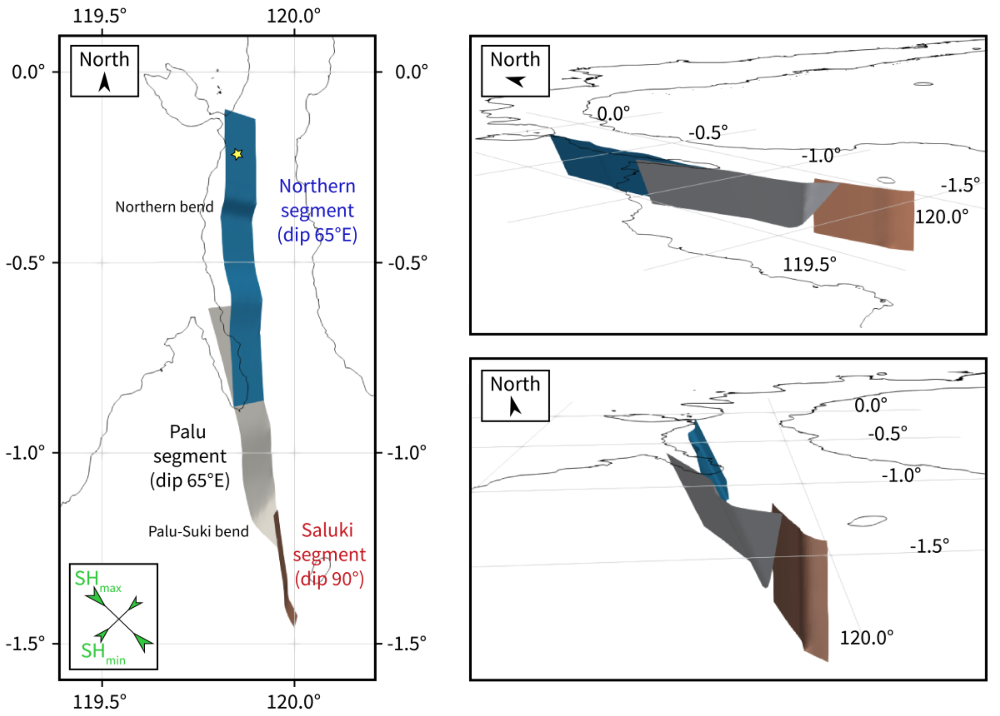

   Screenshot of fault segments for Palu model.

-  Merging box and faults

Let suppose that we know have 2 smd file, one with the intersected faults, 
the other with the box. We can open one of them by: 
Discrete > Add parts > select the other. 
Discrete > Union Parts> select both parts.
This intersects the faults with the topography. 

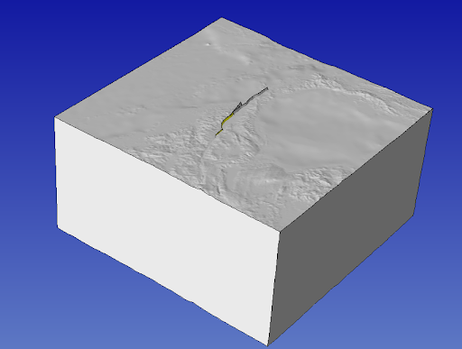

   Screenshot of fault segments and box model with topography in SimModeler.

Now we just have to delete the faults parts above the topography 

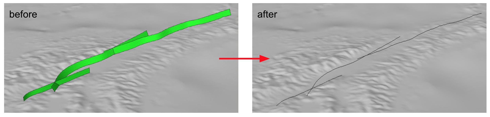

   Screenshot of removing surfaces parts in SimModeler.

and the model is finished.

-  Evaluating the obtained geometric model

Note that when evaluating the model, the shortest edge should not be small 
compared to the expected mesh size and only 1 region should be detected 
(all surface connect into a volume).

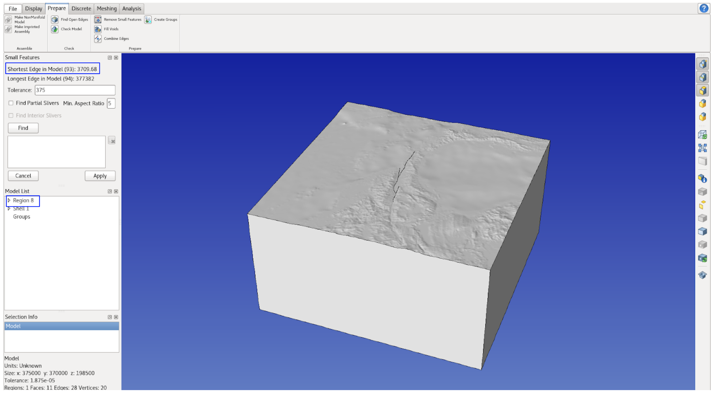

   Screenshot of evaluating the geometric model in SimModeler.

-  Understanding the ‘Discrete Face Rotation Angle Limit’ parameter

The ‘Discrete Face Rotation Angle Limit’ parameter in Surface Meshing 
option is used to refine the surface based on their gradient, 
e.g. 5 km mesh with 5\ :math:`^\circ`.

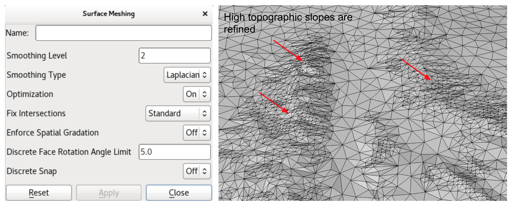

   Screenshot of ‘Discrete Face Rotation Angle Limit’ parameter in Surface Meshing in SimModeler.

3. Volume meshing with unstructured tetrahedral meshing

4. Visualizing the output with Paraview

