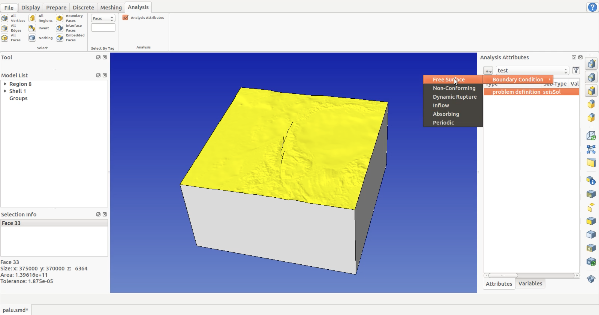
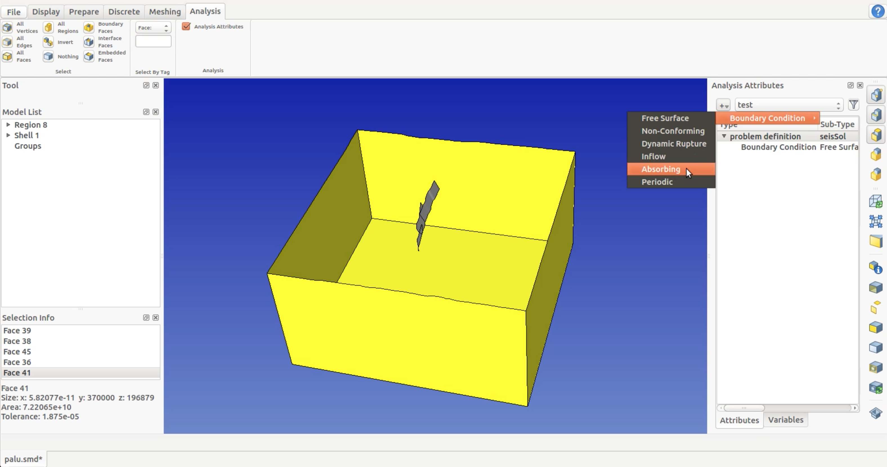
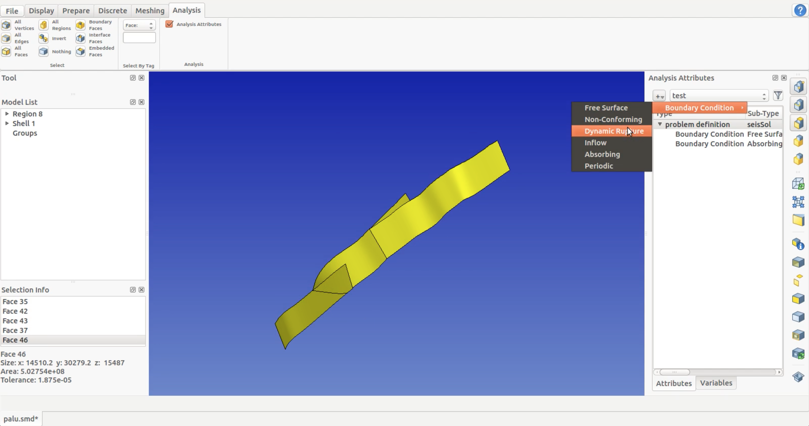
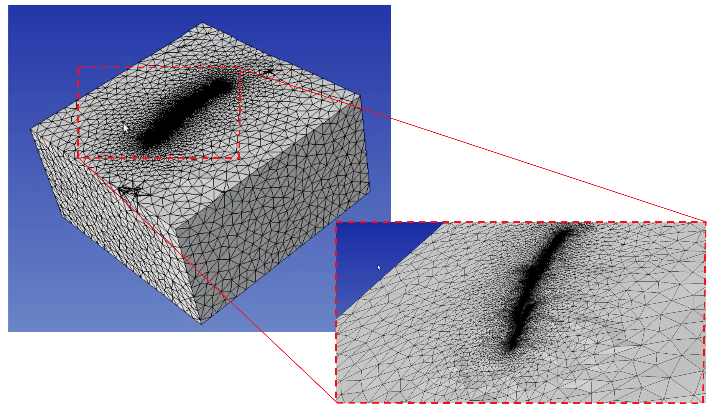
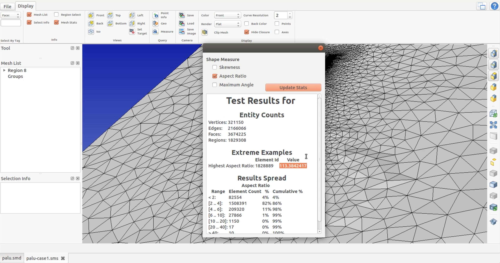
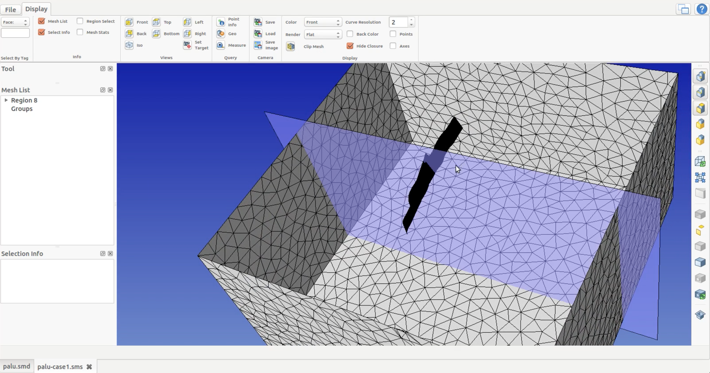
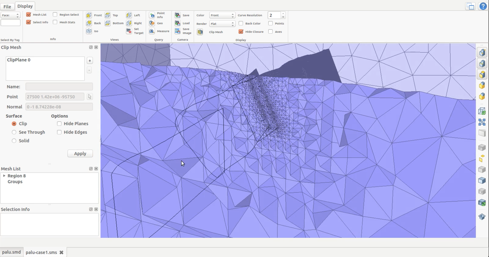
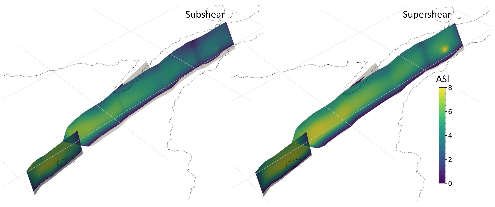
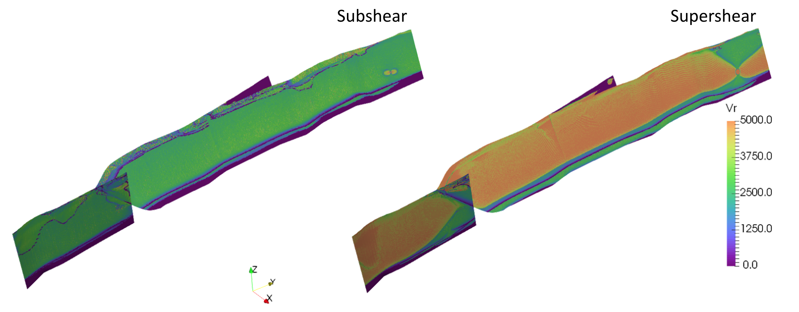

Dynamic rupture model - 2018 Palu earthquake
============================================

A magnitude 7.5 earthquake struck north of Palu, Indonesia on 
September 28, 2018 at 6:03 pm local time (10:03 am UTC). This earthquake 
occurred as a result of Palu-Koro strike-slip fault system at shallow 
depths followed by an unexpected localized tsunami within Palu Bay.

Geometry
~~~~~~~~

In this section, we will build a 3D model with complicated geometries 
using `SimModeler <https://simmetrix.com/index.php/simmodeler/overview>`_.

**1. Creating a high resolution topography and bathymetry free surface 
and merge it with a simple box model**

-  Creating the topographic layer

We create the topography from a NetCDF file downloaded from `GEBCO <https://www.gebco.net/>`_.

.. figure:: LatexFigures/palu_topoGEBCO.png
   :alt: Screenshot from GEBCO.
   :width: 15.00000cm

   Screenshot from GEBCO. GEBCO’s gridded bathymetric data sets are global 
   terrain models for ocean and land. 

We then project the data, triangulate it and  export it as stl (list of triangles):
::
  
  python createGOCADTSurfNXNY_netcdf.py --proj +init=EPSG:23839 data/GEBCO_2014_2D_118.1904_-2.4353_121.6855_1.0113.nc bathy.stl
  
We then load the stl file into SimModeler: File > import discrete data.. > bathy.stl

.. figure:: LatexFigures/palu_stl.png
   :alt: Screenshot of triangulated topography data in SimModeler.
   :width: 15.00000cm

   Screenshot of triangulated topography data in SimModeler. 

Note that in SimModeler import options, importing with a small angle isolate tiny faces from the main surface, 
that then needs to be accounted for by the mesh.

.. figure:: LatexFigures/palu_import.png
   :alt: Screenshot of import options in SimModeler.
   :width: 15.00000cm

   Screenshot of import options in SimModeler. 

-  Creating the domain box

We generate a simple box with `Gmsh <https://gmsh.info/>`_:
::
  
  gmsh -2 create_box.geo -format stl

The box dimensions are such as the topography is slightly wider than the box. 
The mesh size is chosen small enough to facilitate intersection with topography 
and large enough to limit the number of elements.

::
  
  mesh_size = 10e3;
  Xmax = -160e3;
  Xmin = 215e3;
  Ymin = 1235e3;
  Ymax = 1605e3;
  Zmin = -200e3;
  Zmax = 5e3;

.. figure:: LatexFigures/palu_domainbox.png
   :alt: Screenshot of domain box in Gmsh.
   :width: 15.00000cm

   Screenshot of domain box in Gmsh. 

-  Merging topographic layer with a simple box model

We first import create_box.stl with import options: activating 'Edges by Face Normals' with 
normal angle 60\ :math:`^\circ`, activating 'Vertex Detection' with angle along edge 90\ :math:`^\circ`, 
and eliminating 'Dangling Edges'. Then we import the topographic layer bathy.stl with increasing 
'Edges by Face Normals' normal angle to 80\ :math:`^\circ` and activating 'Add New Part in Current Model'.

.. figure:: LatexFigures/palu_topo2domain.png
   :alt: Screenshot of imported topographic layer and the simple box model in SimModeler.
   :width: 15.00000cm

   Screenshot of imported topographic layer and the simple box model in SimModeler. 

We then merge both models by using 'Union Parts' in the 'Discrete' tab and 
apply with tolerance 0.1.

.. figure:: LatexFigures/palu_beforeaftermerge.png
   :alt: Screenshot of before and after merging topographic layer with the simple box model in SimModeler.
   :width: 15.00000cm

   Screenshot of before and after merging topographic layer with the simple 
   box model in SimModeler. 

We then remove excess from both models using 'Delete' in the 'Discrete' tab. 

.. figure:: LatexFigures/palu_aftermerge_domain.png
   :alt: Screenshot of merged domain in SimModeler.
   :width: 15.00000cm

   Screenshot of merged domain in SimModeler. 

**2. Creating complex fault networks constrained by fault traces and dip** 

-  Building faults from trace and dip 

We generate the fault plane using `createFaultFromCurve.py 
<https://github.com/SeisSol/Meshing/blob/master/GocadRelatedScripts/createFaultFromCurve.py>`_. 
Note that during building a fault model we need: smooth and resample fault trace, sweep trace 
towards z positive (because the topography can have positive z) and negative z, 
and constant or varying dip selection.

.. figure:: LatexFigures/palu_tracedipselection.png
   :alt: Screenshot of building fault model from trace and dip.
   :width: 15.00000cm

   Screenshot of building fault model from trace and dip.

-  Application to Palu

The faults then are straightforwardly created using:

::
  
  dx=0.5e3
  python ~/SeisSol/Meshing/GocadRelatedScripts/createFaultFromCurve.py data/segmentSouth_d90_long.dat 0 90 --dd $dx --maxdepth 16e3 --extend 4e3
  python ~/SeisSol/Meshing/GocadRelatedScripts/createFaultFromCurve.py data/smootherNorthBend.dat 0 65 --dd $dx --maxdepth 16e3 --extend 4e3
  python ~/SeisSol/Meshing/GocadRelatedScripts/createFaultFromCurve.py data/segmentBayAndConnectingFault.dat 2 data/segmentBayAndConnectingFaultDip.dat --dd $dx --maxdepth 16e3 --extend 4e3
  

The 'data' folder contains (x,y,z) ASCII files describing fault traces 
and dip variation along-strike.

-  Merging box and faults

Let suppose that we know have 2 smd file, one with the intersected faults, 
the other with the box. We can open one of them by: 
Discrete > Add parts > select the other. 
Discrete > Union Parts> select both parts.
This intersects the faults with the topography. 

.. figure:: LatexFigures/palu_fault2box.png
   :alt: Screenshot of fault segments and box model with topography in SimModeler.
   :width: 15.00000cm

   Screenshot of fault segments and box model with topography in SimModeler.

Now we just have to delete the faults parts above the topography 

.. figure:: LatexFigures/palu_faultexcess.png
   :alt: Screenshot of removing surfaces parts in SimModeler.
   :width: 15.00000cm

   Screenshot of removing surfaces parts in SimModeler.

and the model is finished.

.. figure:: LatexFigures/palu_faultsegments.png
   :alt: Screenshot of fault segments for Palu model.
   :width: 15.00000cm

   Screenshot of fault segments for Palu model.

-  Evaluating the obtained geometric model

Note that when evaluating the model, the shortest edge should not be small 
compared to the expected mesh size and only 1 region should be detected 
(all surface connect into a volume).

.. figure:: LatexFigures/palu_modeleval.png
   :alt: Screenshot of evaluating the geometric model in SimModeler.
   :width: 15.00000cm

   Screenshot of evaluating the geometric model in SimModeler.

-  Understanding the ‘Discrete Face Rotation Angle Limit’ parameter

The ‘Discrete Face Rotation Angle Limit’ parameter in Surface Meshing 
option is used to refine the surface based on their gradient, 
e.g. 5 km mesh with 5\ :math:`^\circ`.

.. figure:: LatexFigures/palu_facerotationlimit.png
   :alt: Screenshot of ‘Discrete Face Rotation Angle Limit’ parameter in Surface Meshing in SimModeler.
   :width: 15.00000cm

   Screenshot of ‘Discrete Face Rotation Angle Limit’ parameter in Surface Meshing in SimModeler.

**3. Volume meshing with unstructured tetrahedral meshing**

-  Assigning boundary conditions

In SimModeler, select 'Analysis' tab then select 'Analysis Attributes'. 
We need to name a 'New Case ...' and select with 'SeisSol' as the solver.
Then select the top surface and assign it with 'Free Surface' boundary condition.

   Screenshot of assigning 'Free Surface' boundary condition in SimModeler.

We hide the top surface, then select all sides and bottom surfaces and assign 
them with 'Absorbing' boundary condition.

   Screenshot of assigning 'Absorbing' boundary condition in SimModeler.

We hide all sides and bottom surfaces, then select all fault segments and assign 
them with 'Dynamic Rupture' boundary condition.

   Screenshot of assigning 'Dynamic Rupture' boundary condition in SimModeler.

-  Setting meshing parameters

We then Select 'Meshing' tab and select 'Mesh Size' to absolute 300 m within 
the fault segments. Next we set 'Mesh Size' to absolute 20000 m at 
the far side of our domain. We also set 'Gradation Rate' to 0.3.
Then we set 'Surface Shape Metric' with limiting aspect ratio to 6.0 and set 
'Volume Shape Metric' with limiting aspect ratio to 12.0. 

Then save (.smd) file and select 'Generate Mesh' and start meshing.

- Evaluating the mesh

After the meshing is completed, select 'Show Mesh'.

   Screenshot of the mesh generated using SimModeler.

We can see the mesh statistics by selecting 'Mesh Stats'.

   Screenshot of the mesh statistics.

We can also clip the mesh using 'Clip Mesh'.

   Screenshot of the clipped mesh.

and then we save the generated mesh file (.neu).

We recommend meshing using `PUMGen <https://github.com/SeisSol/PUMGen/wiki>`_ 
for creating and exporting meshes in an efficient format (`PUML 
<https://seissol.readthedocs.io/en/latest/PUML-mesh-format.html>`_). 
We can use the mesh analysis file (.smd) as the input or 
convert it from the ASCII mesh (.neu) file.

Initial Stress
~~~~~~~~~~~~~~

.. code-block:: YAML

  !EvalModel
  parameters: [Omega, eCS, b_xx, b_yy, b_zz, b_xy, b_yz, b_xz]
  model: !Switch
    [Omega]: !FunctionMap
      #Tappering of the deviatoric stress with depth
      map:
        Omega: |
         zStressDecreaseStart = -11000.;
         zStressDecreaseStop = -15000.;
         zStressDecreaseWidth = zStressDecreaseStart - zStressDecreaseStop;

         if  (z>=zStressDecreaseStart) {
            return 1.0;
         } else {
            if (z>=zStressDecreaseStop) {
               a = 1.0-(z-zStressDecreaseStop)/zStressDecreaseWidth;
               Sx = (3.0*a*a-2.0*a*a*a);
               return 1.0-Sx;
            } else {
              return 0.001;
            }
         }
    [b_xx, b_yy, b_zz, b_xy, b_yz, b_xz]: !EvalModel
      parameters: [effectiveConfiningStress]
      model: !FunctionMap
        map:
          effectiveConfiningStress: |
            return 2670.0*0.21*9.8*min(-1500.0,z);
      components: !OptimalStress
        constants:
          mu_d:      0.1
          mu_s:      0.6
          strike:  -15.0
          dip:      90.0
          rake:      0.0
          cohesion:  0.0
          s2ratio:   0.7
          R:         0.7
    [eCS]: !FunctionMap
      map:
        #avoid positive stress above z=0
        eCS: |
          return 2670.0*0.21*9.8*min(-1500.0,z);
  components: !FunctionMap
    map:
      s_xx:     return Omega*b_xx + (1.0-Omega)*eCS;
      s_yy:     return Omega*b_yy + (1.0-Omega)*eCS;
      s_zz:     return Omega*b_zz + (1.0-Omega)*eCS;
      s_xy:     return Omega*b_xy;
      s_yz:     return Omega*b_yz;
      s_xz:     return Omega*b_xz;

Nucleation
~~~~~~~~~~

Our nucleation has a gaussian shape, with as maximum at the center 
of the nucleation patch.

.. code-block:: YAML

  !EvalModel
  parameters: [b_xx, b_yy, b_zz, b_xy, b_yz, b_xz,ShapeNucleation]
  model: !Switch
    [b_xx, b_yy, b_zz, b_xy, b_yz, b_xz]: !EvalModel
      parameters: [effectiveConfiningStress]
      model: !FunctionMap
        map:
          effectiveConfiningStress: |
            return -(2670.0-1000.0)*9.8*10000.;
      components: !OptimalStress
        constants:
          mu_d:      0.1
          mu_s:      0.6
          strike:  -15.0
          dip:      90.0
          rake:      0.0
          cohesion:  0.0
          s2ratio:   0.7
          R:         4.5
    [ShapeNucleation]: !FunctionMap
      map:
        ShapeNucleation: |
          xc =  17700.0;
          yc = 55580.0;
          zc = -10000.0;
          r_crit = 1500.0;
          r = sqrt(pow(x-xc, 2.0) + pow(y-yc, 2.0) + pow(z-zc, 2.0));
          if (r < r_crit) {
            return exp(pow(r,2.0)/(pow(r,2.0)-pow(r_crit,2.0)));
          }
          return 0.0;
  components: !FunctionMap
    map:
      nuc_xx:     return ShapeNucleation*b_xx;
      nuc_yy:     return ShapeNucleation*b_yy;
      nuc_zz:     return ShapeNucleation*b_zz;
      nuc_xy:     return ShapeNucleation*b_xy;
      nuc_yz:     return ShapeNucleation*b_yz;
      nuc_xz:     return ShapeNucleation*b_xz;

Dynamic Rupture Parameters
~~~~~~~~~~~~~~~~~~~~~~~~~~

.. code-block:: YAML

  !Switch
  [rs_a]: !LayeredModel
    map: !AffineMap
      matrix:
        z0: [0.0, 0.0, 1.0]
      translation:
        z0: 0
    interpolation: linear
    parameters: [rs_a]
    nodes:
       10e10:    [0.02]
       1500.0:  [0.02]
       -4000.0: [0.01]
       -10e10:   [0.01]
  [RS_sl0]: !ConstantMap
    map:
       RS_sl0: 0.2
  [rs_srW]: !LayeredModel
        map: !AffineMap
          matrix:
            z0: [0.0, 0.0, 1.0]
          translation:
            z0: 0
        interpolation: linear
        parameters: [rs_srW]
        nodes:
           10e10:    [1.0]
           1500.0:  [1.0]
           -4000.0: [0.1]
           -10e10:   [0.1]
  [s_xx, s_yy, s_zz, s_xy, s_yz, s_xz]: !Include Sulawesi_initial_stress.yaml
  [nuc_xx,nuc_yy,nuc_zz,nuc_xy, nuc_yz,nuc_xz]: !Include Sulawesi_nucleation_stress.yaml

Results
~~~~~~~

**Illustration with Paraview - a subshear versus a supershear model**

We can simulate a subshear model by decreasing the nucleation 
radius (:math:`r_{crit}`) from 1500 m to 700 m or by decreasing the nucleation
overstress (:math:`R`) from 4.5 to 3.5.

   Screenshot of slip comparison between subshear and supershear model.

   Screenshot of rupture velocity comparison between subshear and supershear model.