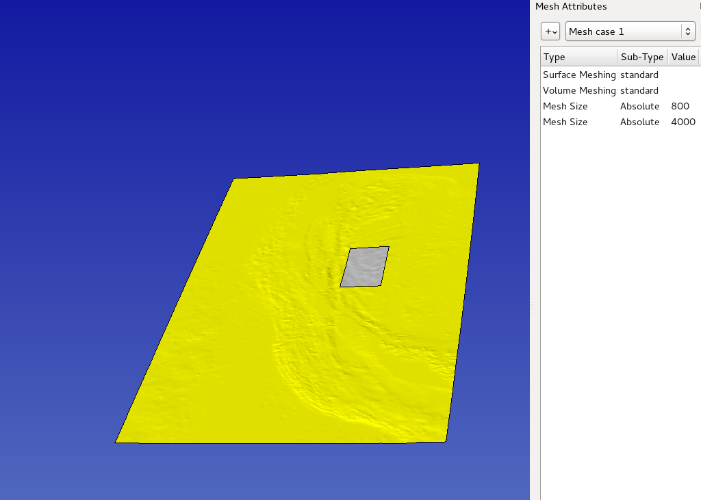
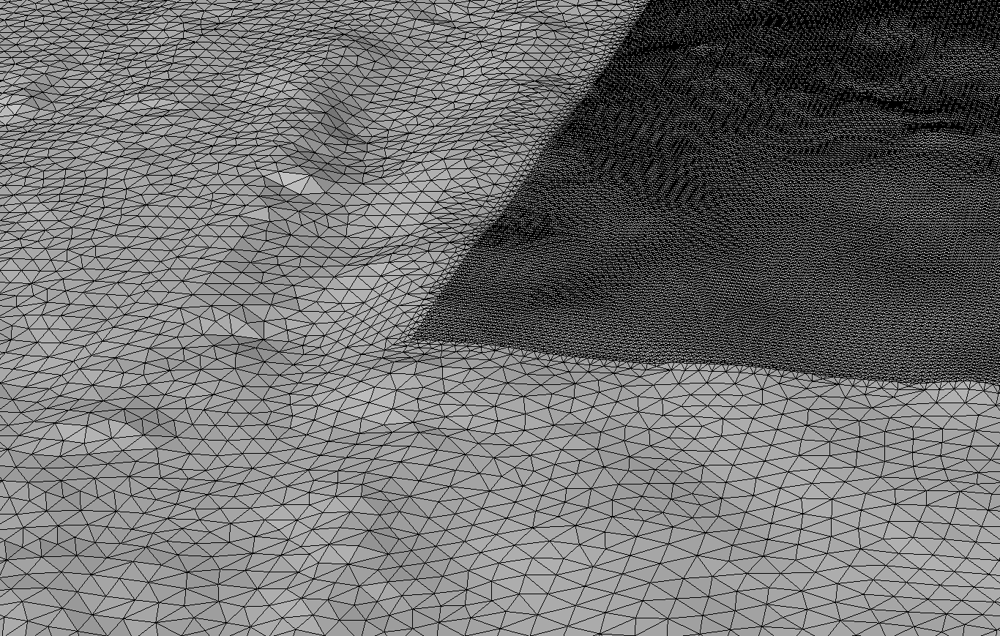

..
  SPDX-FileCopyrightText: 2018-2024 SeisSol Group

  SPDX-License-Identifier: BSD-3-Clause
  SPDX-LicenseComments: Full text under /LICENSE and /LICENSES/

  SPDX-FileContributor: Author lists in /AUTHORS and /CITATION.cff

.. _Remeshing the topography:

Remeshing the topography
========================

Nowadays, high resolution topographic and bathymetric data are most of
the time available. Processing this large amount of data can be a
challenge. For example in Gocad, intersecting such surfaces with other
surfaces can be time-consuming and error-prone.
To overcome these kinds of difficulties, an idea is to coarsen the meshed topography where a
fine resolution is not necessary, before working on the surfaces in
Gocad.

As an illustration, we will process a netcdf file from GEBCO
(`http://www.gebco.net/ <http://www.gebco.net/>`__). It has been used in
Sumatra related simulations. It features a 400m resolution regular grid.
Using the script create_surface_from_rectilinear_grid.py, available
`here <https://github.com/SeisSol/Meshing/tree/master/creating_geometric_models>`__,
we will downsample the data overall, project them and isolate a square
region away from which a fine discretization is not necessary.

| ``python3 create_surface_from_rectilinear_grid.py data/GEBCO_2014_2D_90.0_1.5_97.0_14.5.nc  trash.stl --subsample 2 --proj EPSG:32646  --hole 94 95 8 10``
| Now we can import the data in SimModeler5 (the version is important,
  as SimModeler4 does not have the ABAQUS 2D export):
| File > Import discrete Data > uncheck all.
| |topography in SimModeler| Now we can specify the size we want in the
  central and side areas. Here is the resulting mesh:
| |meshed topography| The mesh can then be exported:
| File > Export mesh > ABAQUS 2D > test.inp (for example).
| We finally convert the inp file to a ts file readable by gocad using:
| ``python3 convertInp.py test.inp --isolate``

