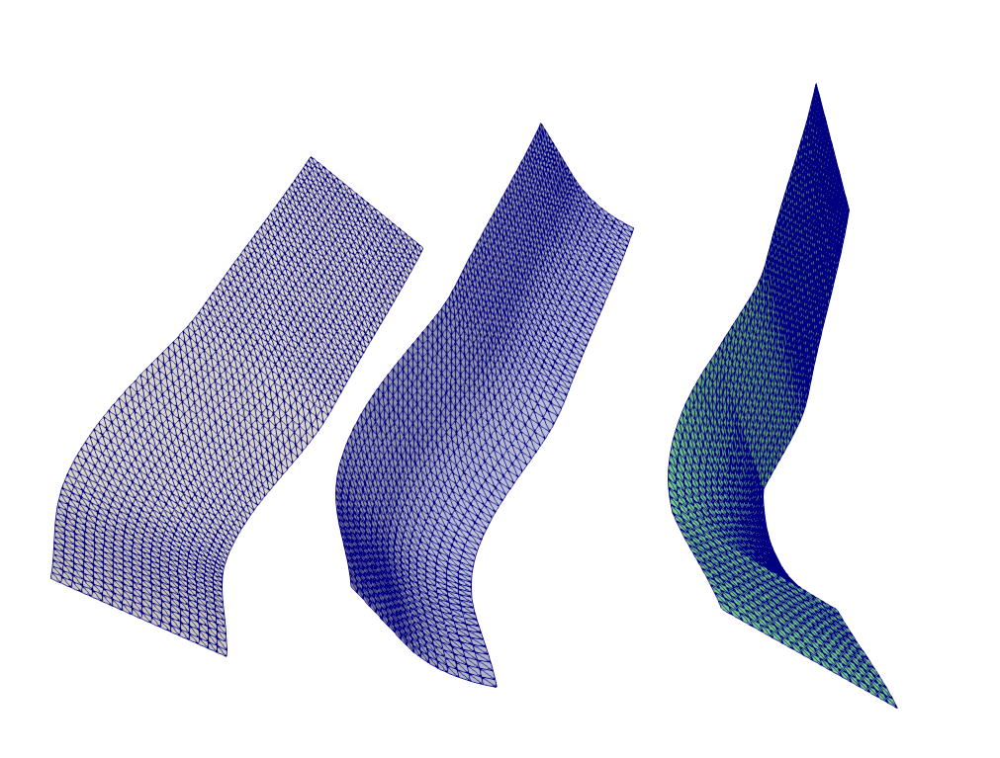
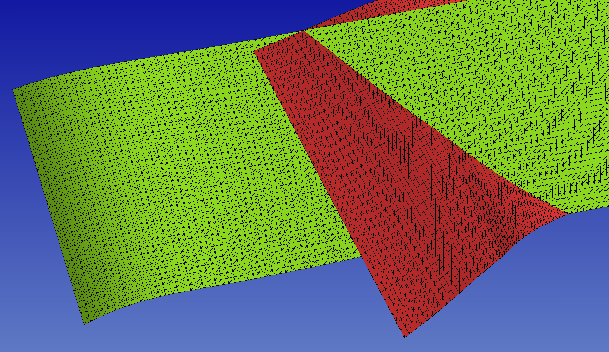
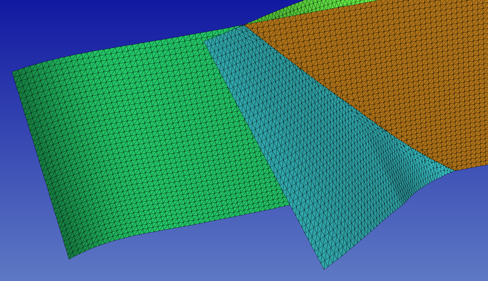

..
  SPDX-FileCopyrightText: 2020-2024 SeisSol Group

  SPDX-License-Identifier: BSD-3-Clause
  SPDX-LicenseComments: Full text under /LICENSE and /LICENSES/

  SPDX-FileContributor: Author lists in /AUTHORS and /CITATION.cff

SimModeler CAD workflow
===========================

In this section, we illustrate the SimModeler CAD workflow by building the structural model of the Palu earthquake dynamic rupture scenario (Ulrich et al., 2019).
We strongly rely on the discrete toolbox of SimModeler, available since September 2019, and on additional python scripts.
We generate a 3d model, incorporating topography and faults geometry.

prerequisite
------------
See :ref:`SimModeler prerequisite`.

We use scripts available `here <https://github.com/SeisSol/Meshing/blob/master/creating_geometric_models>`__ to generate surface meshes of the faults.
The dataset for generating the Palu structural model is available `here <https://github.com/SeisSol/Meshing/blob/master/creating_geometric_models/ExampleFiles/SimModeler_workflow/>`__.

Creating the topographic layer
------------------------------

We create the topography from a netcdf file downloaded from https://www.gebco.net/.
The domain range from longitude 118.9 to 121.7 and from latitude -2.4 to 1.0.
We then project the data (see :ref:`On the use of projections` for the choice of a projection), triangulate it, and export it as stl (list of triangles) using:

.. code-block:: bash

   python3 SeisSol/Meshing/creating_geometric_models/create_surface_from_rectilinear_grid.py --proj '+init=EPSG:23839' data/GEBCO_2014_2D_118.1904_-2.4353_121.6855_1.0113.nc bathy.stl

We then load the stl file into SimModeler

.. code-block:: none

    File>import discrete data>bathy.stl

The option ``Find Edges by Face Normal`` allows isolating groups of triangles using the relative angle between their face normals.
If the angle value is small, the imported surface will appear as divided into many faces.
These faces must then be explicitly accounted for by the mesh. If some faces are tiny, this will mechanically lead to small cells in the final mesh.
We, therefore, recommand to use a large enough value.

Creating the domain box
-----------------------

We generate a surface mesh of a simple box using gmsh:

.. code-block:: bash

   gmsh -2 create_box.geo -format stl

The box dimensions are such as the topography is slightly wider than the box.
The mesh size is chosen small enough to facilitate intersection with topography and large enough to limit the number of elements.

.. code-block:: none

    mesh_size = 10e3;
    Xmax = -160e3;
    Xmin = 215e3;
    Ymin = 1235e3;
    Ymax = 1605e3;
    Zmin=-200e3;
    Zmax=5e3;

Creating faults
---------------

We use `this script <https://github.com/SeisSol/Meshing/blob/master/creating_geometric_models/create_fault_from_trace.py>`__ to generate surface meshes of the faults, using inferred fault traces and dip description.
The scripts first resample the 2D fault trace and then can smooth them.
Finally, the smoothed and resampled traces are swept towards negative and positive (if the topography has positive elevation) z.

create_fault_from_trace.py takes 3 main arguments: ``filename``, ``dipType`` and ``dipDesc``.

- ``filename`` is the name of the ASCII file describing the trace.
- ``dipType`` allow switching between a constant (0), an along-depth dependant (1) or an along-strike dependent (2).
- ``dipDesc`` gives either the dip angle value (dipType=0) or the 1D variation of the dip angle (dipType=1 or 2).

   Fig. 1: example of surface mesh generated using create_fault_from_trace.py and dipType=1 (constant dip, left), 2 (along-depth dependant dip, center), and 3 (along-strike dependent dip, right).

In the Palu case example, the Southern segment dips 90, the Northern segment dips 65, and the middle segment has a varying dip along strike (shallower dip in the southern bend).
We therefore generate the faults using:

.. code-block:: bash

    dx=0.5e3
    python3 SeisSol/Meshing/creating_geometric_models/create_fault_from_trace.py SeisSol/Meshing/creating_geometric_models/ExampleFiles/SimModeler_workflow/segmentSouth_d90_long.dat 0 90 --dd $dx --maxdepth 16e3 --extend 4e3
    python3 SeisSol/Meshing/creating_geometric_models/create_fault_from_trace.py SeisSol/Meshing/creating_geometric_models/ExampleFiles/SimModeler_workflow/smootherNorthBend.dat 0 65 --dd $dx --maxdepth 16e3 --extend 4e3
    python3 SeisSol/Meshing/creating_geometric_models/create_fault_from_trace.py SeisSol/Meshing/creating_geometric_models/ExampleFiles/SimModeler_workflow/segmentBayAndConnectingFault.dat 2 SeisSol/Meshing/creating_geometric_models/ExampleFiles/SimModeler_workflow/segmentBayAndConnectingFaultDip.dat --dd $dx --maxdepth 16e3 --extend 4e3

Mutual surface intersection
----------------------------

SimModeler requires a surface mesh representation of the structural model in which intersection between surfaces (e.g. faults, geologic layers, topography) are explicitly meshed for generating a 3D mesh.
Historically, we used the ‘Mutual surface intersection’ feature of Gocad to intersect the surfaces.
This workflow had several drawbacks. First, Gocad is an expensive software. Also, the ‘Mutual surface intersection’ algorithm is not highly fast and reliable.
Sometimes, problems occur such as holes in the surfaces or small features in the generated surfaces, yielding tiny elements in the mesh (and small timesteps, see e.g. :doc:`manually-fixing-an-intersection-in-gocad`).
Here we use the tools for processing discrete data recently incorporated to SimModeler, which has proven to be superior to GoCAD in intersecting large datasets without artifacts.
We first load all structural surfaces (\*.stl and \*.ts) using:

.. code-block:: none

    File>import discrete data> filenames

When then intersect these datasets using the Discrete tab of SimModeler:

.. code-block:: none

    Discrete>Union parts Add selected (green +), set tolerance 0.1 (e.g.), apply

     Fig. 2: Imported mesh representation of faults without explicitly meshed intersection.

     Fig. 3: Intersected faults, after applying `union parts`

Finally, we remove the part of the surface we do not want in the model using:

.. code-block:: none

    Discrete>Delete. Apply to delete the surface parts that are not needed.

This yields a self-intersecting surface representation of the structural model that can be easily meshed.

