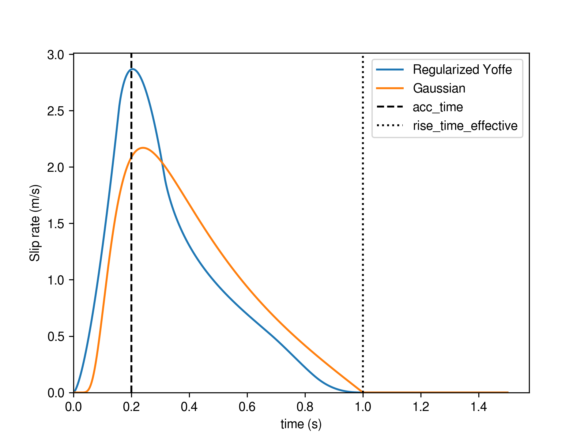

..
  SPDX-FileCopyrightText: 2021-2024 SeisSol Group

  SPDX-License-Identifier: BSD-3-Clause
  SPDX-LicenseComments: Full text under /LICENSE and /LICENSES/

  SPDX-FileContributor: Author lists in /AUTHORS and /CITATION.cff

Slip-rate imposed on a DR boundary
===================================

This "pseudo" friction law allows imposing slip-rate of a kinematic source model as a boundary condition on a fault plane.
This implentation is equivalent to the approach used e.g. in Tinti et al. (2005, https://agupubs.onlinelibrary.wiley.com/doi/10.1029/2005JB003644) and Causse et al. (2014,  https://academic.oup.com/gji/article/196/3/1754/583512#9427920).

The advantage of this approach is that the displacement discontinuity can be accurately represented in SeisSol's discontinuous finite element space.
A multi point-source representation, in comparison, may give rise to spurious waves due the continuity of the basis functions within a finite element (smearing),
and to the discrete spatial sampling between point sources (aliasing).

The current implementation allows either imposing kinematic models parameterized by regularized Yoffe functions (FL=33, see Tinti et al., 2005, https://doi.org/10.1785/0120040177) or by Gaussian  source time functions (FL=34).

   Shape of a regularized Yoffe function (blue) and a Gaussian source time function (orange). We here use rupture_onset=0, acc_time=0.2 and effective_rise_time=1.0.

The Yoffe functions are parametrized by ``rupture_onset``, ``tau_S`` and ``tau_R``, where ``rupture_onset`` is the onset time of the rupture,
``tau_S`` is a parameter closely related (see hereafter) with ``T_acc``, the duration of the positive slip acceleration (time to the peak slip-rate),
and ``tau_R`` is a parameter that, in combination with ``tau_S``, allow defining the effective duration of slip ``tau^eff_R``.

For typical ``tau_S/tau_R`` ratio, we can assume ``T_acc = 1.27 tau_S``. Yet, the factor can range from about 1.15 (for ``tau_S/tau_R`` close to 0) to about 1.4 (for ``tau_S/tau_R`` close to 0.4).
In addition, we can typically assume ``tau^eff_R = tau_R + 2 tau_S``.
Note that in the code, we apply ``tau_R = max(tau_R, tau_S)`` to ensure that ``tau_R`` >= ``tau_S`` (the contrary could occur after interpolation from ASAGI).

The Gaussian source time functions are parametrized by ``rupture_onset`` and  ``rupture_rise_time``.

The slip distribution is defined by the ``strike_slip`` and ``dip_slip`` variables.
All these parameters are read by easi from the dynamic rupture yaml file.

Warning:
 - the direction of positive ``strike_slip`` and ``dip_slip`` is based on the convention of Seissol (e.g. positive strike_slip for right-lateral faulting).
 - Select `SlipRateOutputType=0` in the parameter file to calculate slip-rate output properly.

A fully working example based on Northridge is given at https://github.com/SeisSol/Examples/tree/master/Northridge_FL33.

Note that the yaml and netcdf files describing the kinematic model parameters, and the ts file describing the fault geometry are automatically generated by `this script <https://github.com/SeisSol/SeisSol/blob/master/preprocessing/science/kinematic_models/generate_FL33_input_files.py>`_.
Misfits information printed by this script can help choosing the best threshold value (see option ``--PSRthreshold``) and which of the Yoffe or Gaussian source time function to use.
