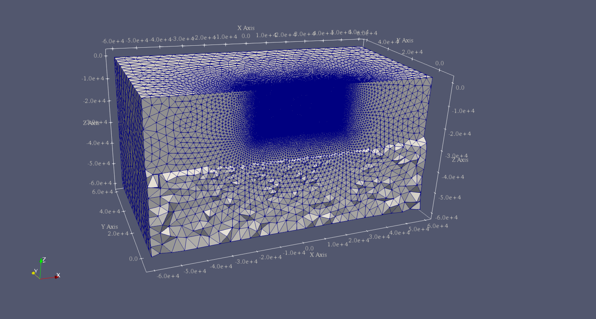

..
  SPDX-FileCopyrightText: 2019-2024 SeisSol Group

  SPDX-License-Identifier: BSD-3-Clause
  SPDX-LicenseComments: Full text under /LICENSE and /LICENSES/

  SPDX-FileContributor: Author lists in /AUTHORS and /CITATION.cff

.. _tpv104:

SCEC TPV104
===========

In this example, we illustrate how to implement **rate-state friction
law** using a slip law with strong rate weakening (RS-SL-SRW) and setup
parameters in SeisSol.

TPV104 has a planar rectangular vertical strike-slip fault with the main
rupture region of velocity-weakening friction, a zone on the fault
surface with transitional friction surrounds the main fault rupture
region, and the outer regions on the fault surface have
velocity-strengthening friction (Figure [fig:tpv104]).

.. figure:: LatexFigures/tpv104.png
   :alt: Diagram of TPV104.
   :width: 9.00000cm
   :align: center

   Diagram of TPV104. The vertical planar fault that has
   velocity-weakening friction region (green), which is surrounded by
   velocity-strengthening region (pink). It encounters a finite width
   transitional region (yellow) where the friction smoothly changes from
   velocity weakening (green) on the inside to velocity strengthening
   (red) on the outside.

Geometry
~~~~~~~~

TPV104 uses the same vertical fault as TPV5. We use the mesh file of TPV5
directly.

RSL parameters
~~~~~~~~~~~~~~

TPV104 uses rate-state friction where shear stress follows:

.. math::

   \begin{aligned}
      \tau = f(V,\psi) \sigma\end{aligned}

The friction coefficient is a function of slip rate :math:`V` and state
:math:`\psi`:

.. math::

   \begin{aligned}
       f(V,\psi) = a *  arcsinh [\frac{V}{2V_0} \exp(\frac{\psi}{a})]\end{aligned}

The state variable evolves according to the equation:

.. math::

   \begin{aligned}
   \frac{d \psi}{dt} = - \frac{V}{L}[\psi - \psi_{ss}(V)]\end{aligned}

 and

.. math::

   \begin{aligned}
      \psi_{ss}(V) = a \ln [\frac{2V_0}{V} \sinh (\frac{f_{ss}(V)}{a})]\end{aligned}

:math:`f_{ss}(V)` is the stead state friction coefficient that depends
on :math:`V` and the friction parameters
:math:`f_0, V_0, a, b, f_w and V_w`.

.. math::

   \begin{aligned}
   f_{ss}(V) = f_w + \frac{f_{LV}(V) - f_w}{[1+(V/V_w)^8]^{1/8}}\end{aligned}

with a low-velocity steady state friction coefficient:

.. math::

   \begin{aligned}
   f_{LV}(V) = f_0 + (b-a) * \ln (V/V_0)\end{aligned}

In SeisSol input file, Rate-state friction law can be used by choosing
*FL=103* in *parameter.par*. The friction parameters of
RS-SL-SRW are shown in Table [table:tpv104rsl].

.. figure:: LatexFigures/table104.png
   :alt: table 104
   :width: 12.0cm
   :align: center

   Table of rate-state friction used in tpv104.

To stop the rupture, the friction law changes from velocity-weakening in
the rectangular interior region of the fault to velocity-strengthening
sufficiently far outside this region. The transition occurs smoothly
within a transition layer of width w = 3 km. Outside the transition
layer, the fault is made velocity-strengthening by increasing :math:`a`
by :math:`\triangle a= 0.01` and :math:`V_w` by
:math:`\triangle V_{w0} = 0.9` .

The input files of TPV104 can be found at https://github.com/SeisSol/Examples/tree/master/tpv104.

   Diagram shows the tetrahedral meshing of TPV 104 shown in the
   ParaView panel.

Results
~~~~~~~

The earthquake nucleates in the velocity-weakening zone spontaneously.
The rupture propagates through the transition zone into the
velocity-strengthening region, where it smoothly and spontaneously
arrests. Nucleation is done by imposing additional shear stress in a
circular patch surrounding the hypocenter.

Figure [fig:tpv104sr] shows the slip rate on the fault along the downdip
direction at T=5s.

.. figure:: LatexFigures/SRs_2s.png
   :alt: Diagram shows the tetrahedral meshing of TPV104
   :width: 12.00000cm
   :align: center

   Slip rate along-strike on the fault at 2 s of TPV104.

.. figure:: LatexFigures/SRs_5s.png
   :alt: Diagram shows the tetrahedral meshing of TPV104
   :width: 12.00000cm
   :align: center

   Slip rate along-strike on the fault at 5 s of TPV 104.

