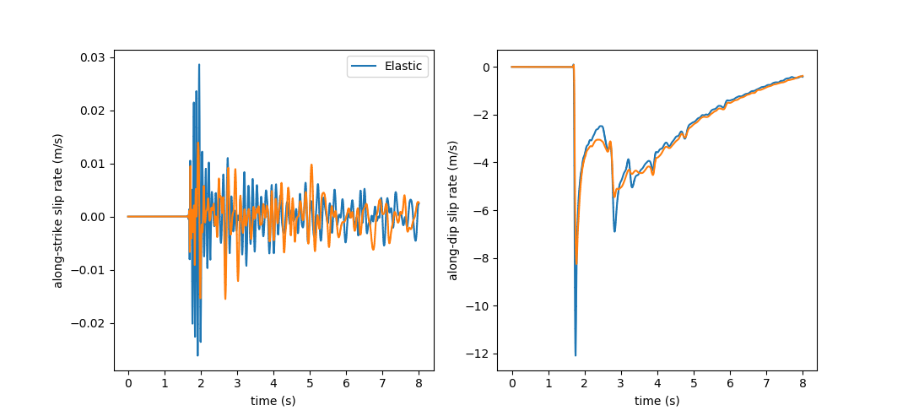

..
  SPDX-FileCopyrightText: 2019-2024 SeisSol Group

  SPDX-License-Identifier: BSD-3-Clause
  SPDX-LicenseComments: Full text under /LICENSE and /LICENSES/

  SPDX-FileContributor: Author lists in /AUTHORS and /CITATION.cff

.. _tpv-13:

SCEC TPV13
==========

TPV13 is similar to TPV12 except for the **non-associative Drucker-Prager visco-plastic** rheology.

The Drucker-Prager yield function is given by:

  :math:`F(\sigma)=\sqrt{J_2(\sigma)}-Y(\sigma)`

:math:`Y(\sigma)` is the  Drucker-Prager yield stress, given as:

  :math:`Y(\sigma) =\max(0,c\cos \phi - (\sigma_m +P_f)\sin \phi)`

with  :math:`\sigma_m = (\sigma_{11}+\sigma_{22}+\sigma_{33})/3` the mean stress,

:math:`c` the bulk cohesion, :math:`\phi` the bulk friction and :math:`P_f` the fluid pressure (1000 kg/m :math:`^3`).
In TPV13 benchmark, :math:`c=` 5.0e+06 Pa and :math:`\phi` =0.85.

:math:`J_2` is the second invariant of the stress deviator:

  :math:`J_2(\sigma) = 1/2 \sum_{ij} s_{ij} s_{ji}`

with :math:`s_{ij} = \sigma_{ij} - \sigma_m \delta_{ij}` the deviator stress components.

The yield equation has to be satisfied:

  :math:`F(\sigma)\leq 0`

When :math:`F(\sigma) < 0`, the material behaves like a linear isotropic elastic material,
with Lame parameters :math:`\lambda` and  :math:`\mu`.

Wen :math:`F(\sigma) = 0`, if the material is subjected to a strain that
tends to cause an increase in :math:`F(\sigma)`, then the material
yields and plastic strains accumulates.

Nucleation
~~~~~~~~~~

TPV13 uses the same nucleation strategy as TPV12.

Plasticity parameters
~~~~~~~~~~~~~~~~~~~~~

To turn on plasticity in SeisSol, add the following lines in `parameters.par <https://github.com/SeisSol/Examples/blob/master/tpv12_13/parameters.par>`_:

.. code-block:: Fortran

  &Equations
  Plasticity = 1 ! default = 0
  Tv = 0.03 ! Plastic relaxation
  /

Plasticity related parameters are defined in **material.yaml**:

.. code-block:: YAML

  !Switch
  [rho, mu, lambda, plastCo, bulkFriction]: !ConstantMap
    map:
      rho:                 2700
      mu:           2.9403e+010
      lambda:        2.941e+010
      plastCo:          5.0e+06
      bulkFriction:        0.85
  [s_xx, s_yy, s_zz, s_xy, s_yz, s_xz]: !Include tpv12_13_initial_stress.yaml

Results
~~~~~~~

:ref:`Figure 1 <TP13_figure_1>` compares the slip-rates along strike and dip in TPV12 (elastic)
and TPV13 (visco-plastic). The peak slip rate in TPV12 is higher than in
TPV13. This difference can be attributed to the inelastic response of the off-fault
material. See Wollherr et al. (2018) for detailed
discussions.

.. _TP13_figure_1:

   Figure 1: along-strike (left) and along-dip (right) slip rate in TPV12 (blue) and 13 (orange).

