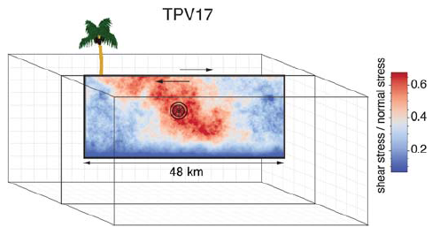
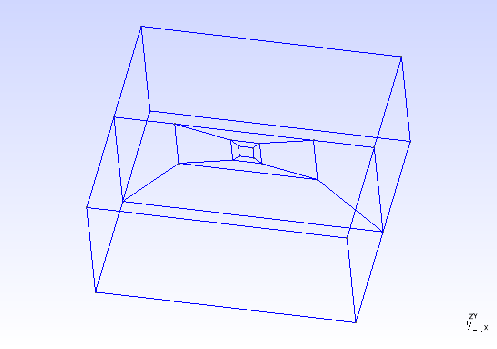
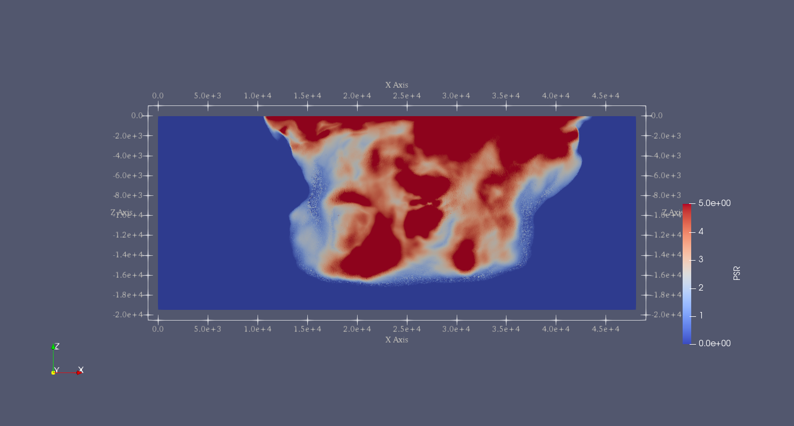

SCEC TPV16/17
=============

TPV16/17 has spontaneous rupture on a vertical, right-lateral,
strike-slip fault in a homogeneous half-space with **randomly-generated
heterogeneous initial stress conditions**. The earthquake rupture is
artificially nucleated in a circular zone on the fault surface. The
rupture then spontaneously propagates outward on the fault surface and
encounters heterogeneous stochastic initial stress conditions,some of
which prevent it from propagating into certain regions on the fault
surface.

   Diagram of TPV16/17. The fault is 40 km long. Colors indicate the
   ratio of shear stress to normal stress at locations on the fault
   surface, at the beginning of the simulation.

Geometry
~~~~~~~~

The fault is a vertical, planar, right-lateral, strike-slip fault. The
fault reaches the Earth’s surface. Rupture is allowed within a
rectangular area measuring 48000 m along-strike and 19500 m down-dip. A
node which lies exactly on the border of the 48000 m :math:`\times`
19500 m rectangle is considered to be inside the rectangle, and so
should be permitted to slip.

The portions of the fault below, to the left of, and to the right of the
48000 m :math:`\times` 19500 m rectangle are a strength barrier, within
which the fault is not allowed to rupture.

In the example, a vertical fault is generated with Gmsh in Figure
[fig:tpv16mesh]. All the files that are needed for the simulation are
provided in .

   Fault geometry of TPV16. Planar fault with nucleation size of 200 m. 

Material parameter
~~~~~~~~~~~~~~~~~~

Rock properties are taken to be linear elastic throughout the 3D model
volume. The problem description can be found at . Table
[table:tpv16material] lists all the material parameters.

+--------------------+--------------------------+-------------+--------------------+
| Parameter          | Description              | Value       | Unit               |
+====================+==========================+=============+====================+
| :math:`\lambda`    | Lame’s first parameter   | 3.2044e10   | Pa                 |
+--------------------+--------------------------+-------------+--------------------+
| :math:`\mu`        | shear module             | 3.2038e10   | Pa                 |
+--------------------+--------------------------+-------------+--------------------+
| :math:`\rho`       | density                  | 2670        | :math:`kg/m^{3}`   |
+--------------------+--------------------------+-------------+--------------------+
| :math:`Q_p`        | P-wave attenuation       | 69.3        |                    |
+--------------------+--------------------------+-------------+--------------------+
| :math:`Q_s`        | S-wave attenuation       | 155.9       |                    |
+--------------------+--------------------------+-------------+--------------------+
| :math:`h_{edge}`   | element edge length      | 200         | m                  |
+--------------------+--------------------------+-------------+--------------------+

Table: Table of bulk and material parameters in TPV16/17.

.. figure:: LatexFigures/tpv16_ts0.jpeg
   :alt: Mapview of fault randomly-generated initial stress in TPV16.
   :width: 11.00000cm

   Mapview of fault randomly-generated initial stress in TPV16. 

Nucleation parameters
~~~~~~~~~~~~~~~~~~~~~

**Initial stress** (Ts0) is randomly-generated in TPV16/17 (Figure
[fig:tpv16ts]).

In TPV16/17, a two-stage nucleation method is used. The first stage is a
circular zone of forced rupture which surrounds the hypocenter. Its
radius is approximately 1 km (the exact radius is determined as part of
the stochastic method that generates the initial stresses). At the
hypocenter, the value of then increases with distance from the
hypocenter, which creates an expanding circular region of forced
rupture. The forced rupture expands at a speed of for 80% of the way,
and then for the remaining 20% of the way to the edge of the zone.
Outside the zone of forced rupture, is equal to 1.0E9, which means that
forced rupture does not occur outside the zone.

The second stage is a circular zone of reduced which surrounds the
hypocenter. Its radius is approximately 4 km (the exact radius is
determined as part of the stochastic method that generates the initial
stresses). In the innermost 10% of the zone, equals 0.04 m. The value of
then increases linearly with distance from the hypocenter, and reaches
its final value of 0.4 m at the edge of the zone. Outside the zone,
equals 0.4 m. The effect is to create a circular region of reduced
fracture energy surrounding the hypocenter, which helps the rupture to
expand during the early part of the simulation.

Results
~~~~~~~

The earthquake nucleates and the rupture propagates on the fault surface
due to the heterogenous stress ratio on the fault. Figure
[fig:tpv16slip] shows the fault slip rate along strike-direction at
T=5.5 s.

   Mapview of fault slip rate along strike-direction. 

There are several receivers on the fault surface. Figure
[fig:tpv16fault] shows slip rate along the strike- and downdip-direction
on the fault at point (15 km, 0 km, -9 km).

.. figure:: ./LatexFigures/sliprate_16.png
   :alt: Fault slip along strike- (left)and downdip- (right) direction.
   :width: 11.00000cm

   Fault slip along strike- (left)and downdip- (right) direction.
   
.. figure:: ./LatexFigures/tpv16_uvw1.png
   :alt: Velocity at two opposite stations across the fault surface.
   :width: 11.00000cm

   Velocity at two opposite stations across the fault surface.
   
   
   
   
