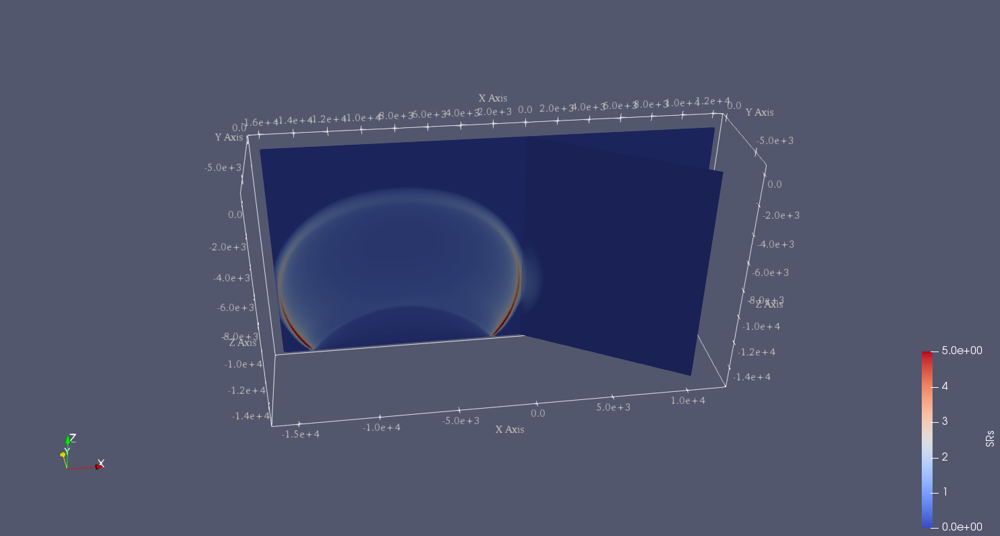
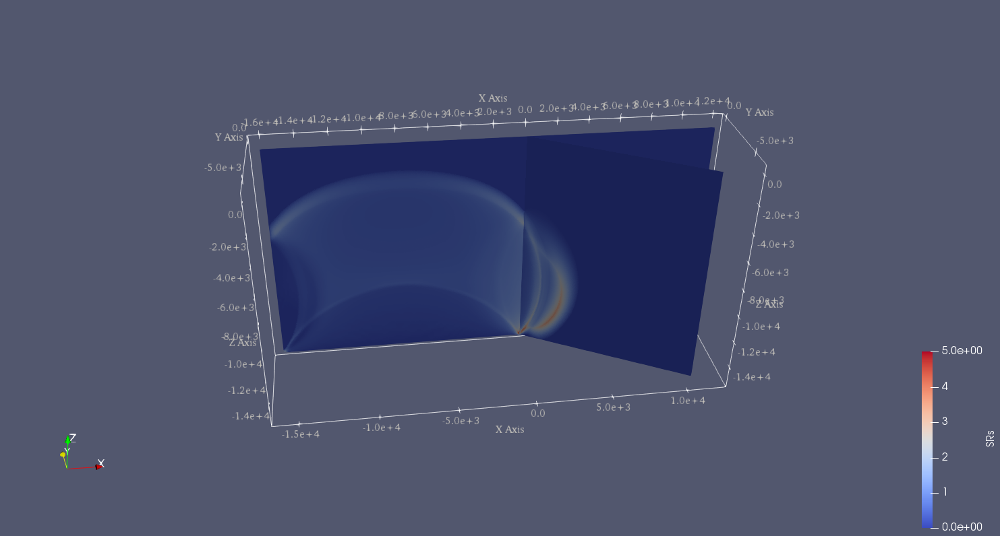

..
  SPDX-FileCopyrightText: 2019-2024 SeisSol Group

  SPDX-License-Identifier: BSD-3-Clause
  SPDX-LicenseComments: Full text under /LICENSE and /LICENSES/

  SPDX-FileContributor: Author lists in /AUTHORS and /CITATION.cff

.. _tpv24:

SCEC TPV24
==========

TPV24 is designed to illustrate dynamic rupture in a **fault branching**
system. TPV24 contains two vertical, planar strike-slip faults; the main
fault and a branch fault intersecting at an angle of 30 degrees (Figure
[fig:tpv24]). The earthquake rupture is artificially nucleated in a
circular zone on the main fault surface and then spontaneously
propagates to the branching fault.

.. figure:: LatexFigures/tpv24.png
   :alt: Diagram of TPV24 branching fault geometry.
   :width: 11.00000cm
   :align: center

   Diagram of TPV24 branching fault geometry. The main fault is (16 000
   + 12 000) m and the branching fault is 12 000 m. Both faults are 15 000
   m wide. The intersecting angle is 30 degrees. The nucleation patch locates at 10 000 m depth and 8000 m horizontally from the joint point.

Geometry
~~~~~~~~

There are two faults, called the main fault and the branch fault (Figure
[fig:tpv24]). The two faults are vertical, planar, strike-slip faults.
The faults reach the earth’s surface.

The main fault is a rectangle measuring 28 000 m along-strike and 15 000
m deep. The branch fault is a rectangle measuring 12 000 m along-strike
and 15 000 m deep. There is a junction point. It is located 12 000 m
from the right edge of the main fault, and the main fault passes through
it.

The branch fault makes an angle of 30 degrees to the main fault. The
branch fault ends at the junction point.

The hypocenter is centered along-strike at a depth of 10 km on the left
side of the main fault. That is, the hypocenter is 8000 m from the
junction point, and 10 000 m deep.

Figure [fig:tpv24mesh] shows the fault model generated in Gmsh. The mesh
file can be generated using https://github.com/SeisSol/Examples/blob/master/tpv24/generating_the_mesh.sh.

.. figure:: LatexFigures/tpv24mesh.png
   :alt: Geometry generated in Gmsh of TPV24. Main fault lies in y-plane.
   :width: 9.00000cm
   :align: center

   Geometry generated in Gmsh of TPV24. The main fault lies in y-plane.

Initial stress
~~~~~~~~~~~~~~

The initial stress condition is depth-dependent at the depth above 15600
m. Table [table:tpv24] summarizes the initial stress conditions in
TPV24.

+----------------------------+--------------------------------+---------+-----------------+
| Parameter                  | Description                    | Value   | Unit            |
+============================+================================+=========+=================+
| s\_zz                      | :math:`\sigma_{zz}`            |-2670\*9.8\*depth | Pa     |
+----------------------------+--------------------------------+---------+-----------------+
| s\_xz                      | :math:`\sigma_{xz}`            | 0       | Pa              |
+----------------------------+--------------------------------+---------+-----------------+
| P_f                        | fluid pressure                 | 1000*9.8*depth    | Pa    |
+----------------------------+--------------------------------+---------+-----------------+
| s\_yz                      | :math:`\sigma_{yz}`            | 0.0     |  Pa             |
+----------------------------+--------------------------------+---------+-----------------+
|                           inside the nucleation zone                                    |
+----------------------------+--------------------------------+---------+-----------------+
| s\_yy                      | |  :math:`b33*(\sigma_{zz} + P_f) - P_f` |  Pa             |
+----------------------------+--------------------------------+---------+-----------------+
| s\_xx                      |  | :math:`b22*(\sigma_{zz} + P_f) - P_f` |  Pa             |
+----------------------------+--------------------------------+---------+-----------------+
| s\_xy                      |  | :math:`b23*(\sigma_{zz} + P_f)`       |  Pa             |
+----------------------------+--------------------------------+---------+-----------------+
|                           outside the nucleation zone                                   |
+----------------------------+--------------------------------+---------+-----------------+
| s\_yy                      |                   |  :math:`\sigma_{zz}` |  Pa             |
+----------------------------+--------------------------------+---------+-----------------+
| s\_xx                      |                    | :math:`\sigma_{zz}` |  Pa             |
+----------------------------+--------------------------------+---------+-----------------+
| s\_xy                      |                                  | 0     |  Pa             |
+----------------------------+--------------------------------+---------+-----------------+

Note that the effective stress tensor is :

  .. math::

     \bar{\sigma}_{effective}=
     \begin{bmatrix}
     &\sigma_{xx} + P_f , & \sigma_{xy} ,& \sigma_{xz}  \\
     &\sigma_{xy}, &\sigma_{yy} +P_f , &\sigma_{yz} \\
     &\sigma_{xz} ,&\sigma_{yz} ,  &\sigma_{zz} +P_f
     \end{bmatrix}

Nucleation parameters
~~~~~~~~~~~~~~~~~~~~~

**Nucleation** is performed by forcing the fault to rupture, within a
circular zone surrounding the hypocenter. Forced rupture is achieved by
artificially reducing the friction coefficient, beginning at a specified
time. The parameter specifies how long it takes for the friction
coefficient to be artificially reduced from its static value to its
dynamic value. So, the friction coefficient reaches its dynamic value at
time. We reduce the friction coefficient gradually, over an interval of
time, in order to smooth the nucleation process and reduce unwanted
oscillations.

.. math::

   T = \left\{
   \begin{array}{lr}
   & \frac{r}{0.7Vr} + \frac{0.081*r_{crit} }{0.7Vr} (\frac{1}{1-(r/r_{crit})^2} - 1),  r \leq  r_{crit} \\
   & 1E+09, r > r_{crit}\\
   \end{array}
   \right.

The **cohesion** zone is defined as :

.. math::

   C_0 = \left\{
   \begin{array}{lr}
   & 0.3 + 0.000675 * (4000 - depth),  depth < 4000 m \\
   & 0.3 MPa, depth \geq 4000 m\\
   \end{array}
   \right.

Note that the frictional cohesion is 3.00 MPa at the earth’s surface. It
is 0.30 MPa at depths greater than 4000 m, and its value is linearly
tapered in the uppermost 4000 m.

The friction parameters are listed in Table [table:tpv24fric].

+-------------+--------------------------------+---------+--------+
| Parameter   | Description                    | Value   | Unit   |
+=============+================================+=========+========+
| mu\_s       | static friction coefficient    | 0.18    |        |
+-------------+--------------------------------+---------+--------+
| mu\_d       | dynamic friction coefficient   | 0.12    |        |
+-------------+--------------------------------+---------+--------+
| d\_c        | critical distance              | 0.30    | m      |
+-------------+--------------------------------+---------+--------+
| C\_0        | fault cohesion                 |         | Pa     |
+-------------+--------------------------------+---------+--------+
| T           | forced rupture time            |         | s      |
+-------------+--------------------------------+---------+--------+
| t\_0        | forced rupture delay time      | 0.5     | s      |
+-------------+--------------------------------+---------+--------+

Table: Table of LSR parameters on the fault in TPV24.

Results
~~~~~~~

The model is run for 12.0 seconds after nucleation. The earthquake
rupture is artificially nucleated in a circular zone on the main fault
surface. The rupture then spontaneously propagates on the main fault and
encounters a branching fault. The branching fault continues to rupture
as well as the rest main fault. The fault slip rate is shown in Figure
[fig:tpv24result1].

   Snapshot of slip rate in branching fault system. Slip rate at 2 s.

   Snapshot of slip rate in branching fault system. Slip rate at 3.5 s.

