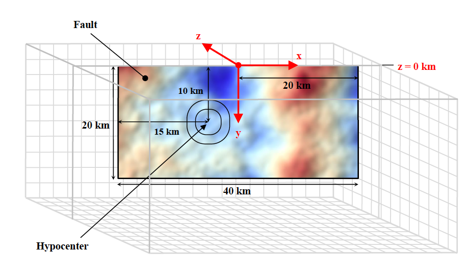
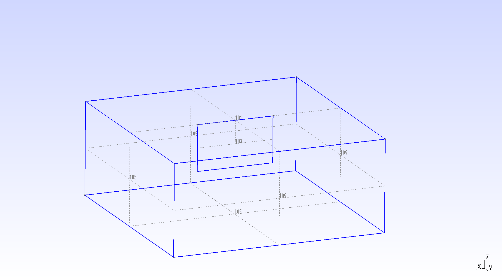

SCEC TPV29
==========

TPV 29 constains a vertical, right-lateral fault with **rough fault
interface** (Figure [fig:tpv29]). The fault surface has 3D stochastic
geometrical roughness (blue and red colors). In TPV 29, the surrounding
rocks respond elastically.

   Diagram of TPV 29. The fault is 40 km long along the strike. There is
   a circular nucleation zone on the right-lateral fault surface. The
   fault surface has 3D stochastic geometrical roughness (blue and red
   colors). The hypocenter is located 15 km from the left edge of the
   fault, at a depth of 10 km. 

Geometry
~~~~~~~~

The roughed fault interface model is generated with Gmsh is complicated
than planar faults in previous sections. There are 5 steps to generate
the model.

1.Download fault topography data from SCEC. There are 2001 nodes
  along the strike and 1201 nodes along the downdip. The node files
  should contains:
  
::
  
   Line 1: nx, ny
   Line 2 to nx: positions of nodes along the strike (in meters)
   Line nx+3 to ny+nx+3: positions of nodes along the downdip (in meters)
   Line to the end: fault topography of each nodes (nx\*ny, in meters)
   

Save this file as *mytopo\_tpv29*.

2.Make a model with plane fault as Figure [fig:tpv29geo]. The Gmsh
tpv29.geo file can be found at

   Diagram showing the geometry of TPV 29. The center of nucleation is
   at (-8, 0, -10) km on the main fault. 

3.Use *gmsh_plane2topo.f90* and interpol_topo.in* to shift the planar
fault according to positions given in *mytopo_tpv29*.

:: 

  $ ./gmsh_plane2topo interpol_topo.in

This will generate a step1\_modified.msh file which containing rough
  fault surface.

4.Make a new step2.geo file that contains the new rough fault and mesh
following general Gmsh process.

.. figure:: LatexFigures/tpv29mesh.png
   :alt: Diagram showing the geometry of TPV 29.
   :width: 11.00000cm

   Diagram showing the geometry of TPV 29. The center of nucleation is
   at (-8, 0, -10) km on the main fault. 
   
5. Generate MSH mesh with the command line:
::

  & gmsh tpv29_step2.geo -3 -optimize_netgen -o tpv29_step2.msh
  
option optimize_netgen is necessary for optimizing meshing with good quality.

Material parameters
~~~~~~~~~~~~~~~~~~~

In TPV29, the entire model volume is a linear elastic material, with the
following parameters listed in Table [table:tpv29material].

+--------------------+--------------------------+-------------+--------------------+
| Parameter          | Description              | Value       | Unit               |
+====================+==========================+=============+====================+
| :math:`\rho`       | density                  | 2670        | :math:`kg/m^{3}`   |
+--------------------+--------------------------+-------------+--------------------+
| :math:`\lambda`    | Lame’s first parameter   | 3.2044e10   | Pa                 |
+--------------------+--------------------------+-------------+--------------------+
| :math:`\mu`        | shear module             | 3.2038e10   | Pa                 |
+--------------------+--------------------------+-------------+--------------------+
| :math:`h_{edge}`   | element edge length      | 200         | m                  |
+--------------------+--------------------------+-------------+--------------------+
| :math:`V_p`        | P wave velocity          | 6000        | m/s                |
+--------------------+--------------------------+-------------+--------------------+
| :math:`V_s`        | S wave velocity          | 3464        | m/s                |
+--------------------+--------------------------+-------------+--------------------+

[table:tpv29material]

Initial stress
~~~~~~~~~~~~~~

The initial stress are listed in Table [table:tpv29fault].

+---------------+-------------------------------------+---------------------------------------------------+--------+
| Parameter     | Description                         | Value                                             | Unit   |
+===============+=====================================+===================================================+========+
| mu\_s         | static friction coefficient         | 0.12                                              |        |
+---------------+-------------------------------------+---------------------------------------------------+--------+
| mu\_d         | dynamic friction coefficient        | 0.18                                              |        |
+---------------+-------------------------------------+---------------------------------------------------+--------+
| d\_c          | critical distance                   | 0.30                                              | m      |
+---------------+-------------------------------------+---------------------------------------------------+--------+
| s\_zz         | :math:`\sigma_{zz} `                | -2670\*9.8\*depth                                 | Pa     |
+---------------+-------------------------------------+---------------------------------------------------+--------+
| Pf            | fluid pressure                      | 1000\*9.8\*depth                                  | Pa     |
+---------------+-------------------------------------+---------------------------------------------------+--------+
| s\_xz,s\_yz   | :math:`\sigma_{xz},  \sigma_{yz}`   | 0                                                 | Pa     |
+---------------+-------------------------------------+---------------------------------------------------+--------+
| s\_yy         |                                     | :math:`\Omega * b33*(\sigma_{zz} + P_f) - P_f `   | Pa     |
+---------------+-------------------------------------+---------------------------------------------------+--------+
| s\_xx         |                                     | :math:`\Omega * b11*(\sigma_{zz} + P_f) - P_f `   | Pa     |
+---------------+-------------------------------------+---------------------------------------------------+--------+
| s\_xy         |                                     | :math:`\Omega * b13*(\sigma_{zz} + P_f)  `        | Pa     |
+---------------+-------------------------------------+---------------------------------------------------+--------+

Table: Table of initial stress in TPV 29. :math:`b11, b33,b13` are
1.025837, 0.974162, −0.158649, respectively.

| Note that the effective stress tensor is :
| 

  .. math::

     \bar{\sigma}_{effective}= 
     \begin{bmatrix}
     &\sigma_{xx} + P_f , & \sigma_{xy} ,& \sigma_{xz}  \\
     &\sigma_{xy}, &\sigma_{yy} +P_f , &\sigma_{yz} \\
     &\sigma_{xz} ,&\sigma_{yz} ,  &\sigma_{zz} +P_f 
     \end{bmatrix}

where :math:`\Omega` is defined as:

.. math::

   \Omega = \left\{
   \begin{array}{lr} 
   &1, depth \leq 17000 m \\
   & (22000 - depth)/5000 m,  17000 < depth < 22000 m \\
   & 0, depth \geq 22000 m\\
   \end{array}
   \right.

Nucleation parameters
~~~~~~~~~~~~~~~~~~~~~

TPV29 use the similar strategy for dynamic rupture nucleation.

.. math::

   T = \left\{
   \begin{array}{lr}
   & \frac{r}{0.7Vr} + \frac{0.081*r_{crit} }{0.7Vr} (\frac{1}{1-(r/r_{crit})^2} - 1),  r \leq  r_{crit} \\
   & 1E+09, r > r_{crit}\\
   \end{array}
   \right.

The cohesion zone is defined as :

.. math::

   C_0 = \left\{
   \begin{array}{lr}
   & 0.4 MPa + 0.000675 MPa * (4000- depth),  depth < 4000 m \\
   & 0.4 MPa, depth \geq 4000 m\\
   \end{array}
   \right.

The friction parameters on the fault are listed in Table
[table:tpv29fric].

+-------------+--------------------------------+---------+--------+
| Parameter   | Description                    | Value   | Unit   |
+=============+================================+=========+========+
| mu\_s       | static friction coefficient    | 0.12    |        |
+-------------+--------------------------------+---------+--------+
| mu\_d       | dynamic friction coefficient   | 0.18    |        |
+-------------+--------------------------------+---------+--------+
| d\_c        | critical distance              | 0.30    | m      |
+-------------+--------------------------------+---------+--------+
| t\_0        | forced rupture delay time      | 0.5     | s      |
+-------------+--------------------------------+---------+--------+

Table: Table of friction parameters in TPV 29.

Results
~~~~~~~

The earthquake rupture is artificially nucleated in a circular zone on
the fault surface.

.. figure:: LatexFigures/tpv29_srs.png
   :alt: Snapshot of slip rate along the strike
   :width: 11.00000cm

   Snapshot of slip rate along the strike at T=3 s in TPV 29. The fault
   has a rough surface. 
   
