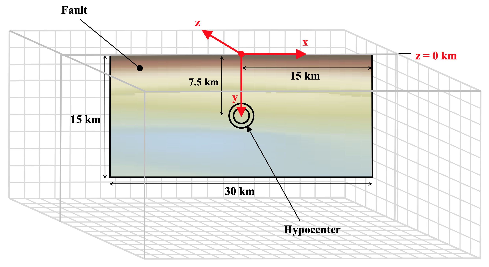
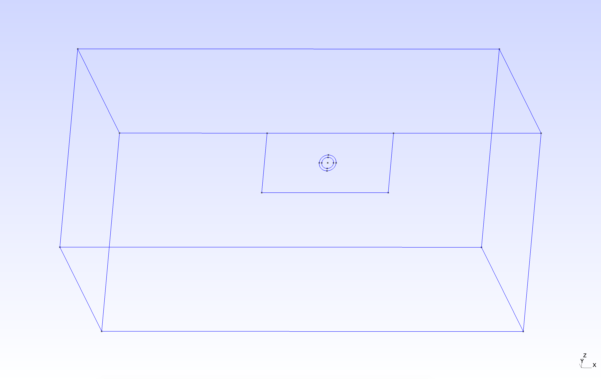
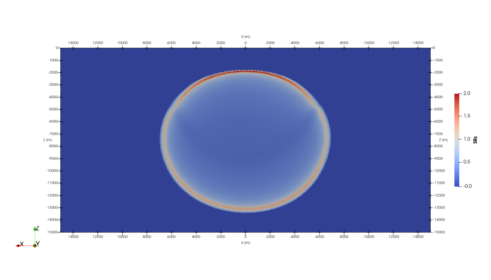

..
  SPDX-FileCopyrightText: 2019-2024 SeisSol Group

  SPDX-License-Identifier: BSD-3-Clause
  SPDX-LicenseComments: Full text under /LICENSE and /LICENSES/

  SPDX-FileContributor: Author lists in /AUTHORS and /CITATION.cff

.. _tpv34:

SCEC TPV34
==========

The TPV34 benchmark features a right-lateral, planar, vertical, strike-slip fault
set in a half-space. The velocity structure is the actual 3D velocity structure
surrounding the Imperial Fault, as given by the SCEC Community Velocity Model
`CVM-H <https://strike.scec.org/scecpedia/CVM-H>`_.

.. figure:: LatexFigures/tpv34_imperialfault.png
   :alt: The Imperial Fault.
   :width: 15.00000cm
   :align: center

   The Imperial Fault. The red line marks the Imperial Fault. It straddles the California-Mexico border, south of the Salton Sea. The Imperial Fault is approximately 45 km long and 15 km deep, with a nearly vertical dip angle ranging from 81 to 90 degrees according to the SCEC Community Fault Model CFM-4.

Geometry
~~~~~~~~

The model volume is a half-space. The fault is a vertical,
planar, strike-slip fault. The fault reaches the Earth’s surface. Rupture is
allowed within a rectangular area measuring 30000 m along-strike and
15000 m down-dip.

There is a circular nucleation zone on the fault surface. The hypocenter is
located 15 km from the left edge of the fault, at a depth of 7.5 km.

   TPV34 overview.

The geometry is generated with `Gmsh <https://gmsh.info/>`_. All the files
that are needed for the simulation are provided at
https://github.com/SeisSol/Examples/tree/master/tpv34.

   Modeled TPV34 fault in Gmsh.

Material
~~~~~~~~

To obtain the velocity structure for TPV34, we need to install and run
the SCEC Community Velocity Model software distribution `CVM-H <https://strike.scec.org/scecpedia/CVM-H>`_.
For TPV34, we are using CVM-H version 15.1.0 and we use
`ASAGI <https://github.com/TUM-I5/ASAGI>`_ to map the material properties variations onto the mesh.
Detailed explanations are provided at
https://github.com/SeisSol/Examples/blob/master/tpv34/generate_ASAGI_file.sh.
We generate 2 netcdf files of different spatial resolution to map more finely the 3D material properties close to the fault.
The domain of validity of each netcdf files read by ASAGI is defined by the yaml tpv34_material.yaml file:

.. code-block:: YAML

  [rho, mu, lambda]: !IdentityMap
    components:
      # apply a finer CVM-H data inside the refinement zone
      - !AxisAlignedCuboidalDomainFilter
        limits:
          x: [-25000.0, 25000.0]
          y: [-25000.0, 25000.0]
          z: [-15000.0, 0.0]
        components: !ASAGI
          file: tpv34_rhomulambda-inner.nc
          parameters: [rho, mu, lambda]
          var: data
      # apply a coarser CVM-H data outside the refinement zone
      - !ASAGI
          file: tpv34_rhomulambda-outer.nc
          parameters: [rho, mu, lambda]
          var: data

Parameters
~~~~~~~~~~

TPV34 uses a linear slip weakening law on the fault. The parameters are
listed in Table below.

+-------------+--------------------------------+------------+--------+
| Parameter   | inside the nucleation zone     | Value      | Unit   |
+=============+================================+============+========+
| mu\_s       | static friction coefficient    | 0.58       |        |
+-------------+--------------------------------+------------+--------+
| mu\_d       | dynamic friction coefficient   | 0.45       |        |
+-------------+--------------------------------+------------+--------+
| d\_c        | critical distance              | 0.18       | m      |
+-------------+--------------------------------+------------+--------+

The cohesion is 1.02 MPa at the earth’s surface. It is 0 MPa at depths
greater than 2400 m, and is linearly tapered in the uppermost 2400 m.
The spatial dependence of the cohesion is straightforwardly mapped
using `Easi <https://github.com/SeisSol/easi>`_.

.. code-block:: YAML

  [mu_d, mu_s, d_c]: !ConstantMap
    map:
      mu_d: 0.45
      mu_s: 0.58
      d_c: 0.18
  [cohesion]: !FunctionMap
    map:
      cohesion: |
        return -425.0*max(z+2400.0,0.0);

Initial stress
~~~~~~~~~~~~~~

The initial shear stress on the fault is pure right-lateral.

  The initial shear stress is :math:`\tau_0` = (30 MPa)(:math:`\mu_x`)

  The initial normal stress on the fault is :math:`\sigma_0` = (60 MPa)(:math:`\mu_x`).

In above formulas, we define :math:`\mu_x = \mu / \mu_0`, where
:math:`\mu` is shear modulus and
:math:`\mu_0` = 32.03812032 GPa.

.. code-block:: YAML

  [s_xx, s_yy, s_zz, s_xy, s_yz, s_xz]: !EvalModel
    parameters: [radius,mux]
    model: !Switch
      [mux]: !AffineMap
        matrix:
          x: [1.0,0.0,0.0]
          z: [0.0,0.0,1.0]
        translation:
          x: 0.0
          z: 0.0
        components: !ASAGI
          file: tpv34_mux-fault.nc
          parameters: [mux]
          var: data
      [radius]: !FunctionMap
        map:
          radius: |
            xHypo =     0.0;
            zHypo = -7500.0;
            return sqrt(((x+xHypo)*(x+xHypo))+((z-zHypo)*(z-zHypo)));
    components: !FunctionMap
      map:
        s_xx:     return -60000000.0*mux;
        s_yy:     return -60000000.0*mux;
        s_zz:     return 0.0;
        s_xy: |
          pi = 4.0 * atan (1.0);
          s_xy0 = 30000000.0*mux;
          s_xy1 = 0.0;
          if (radius<=1400.0) {
            s_xy1 = 4950000.0*mux;
          } else {
            if (radius<=2000.0) {
              s_xy1 = 2475000.0*(1.0+cos(pi*(radius-1400.0)/600.0))*mux;
            }
          }
          return s_xy0 + s_xy1;
        s_yz:     return 0.0;
        s_xz:     return 0.0;

Results
~~~~~~~
All examples here can be visualized in Paraview. The *output* folder contains a series of files for
fault dynamic rupture (hdf5 and .xdmf), wavefield (hdf5 and .xdmf), on-fault receiver (.dat) and
off-fault receivers (.dat). The fault dynamic rupture and wavefield files can be loaded in Paraview.
For example, open Paraview and then go through File > import > 'prefix'-fault.xdmf.

   Fault slip rate in the along-strike direction (SRs) at a rupture time of 3 seconds in TPV34, visualized using Paraview.
